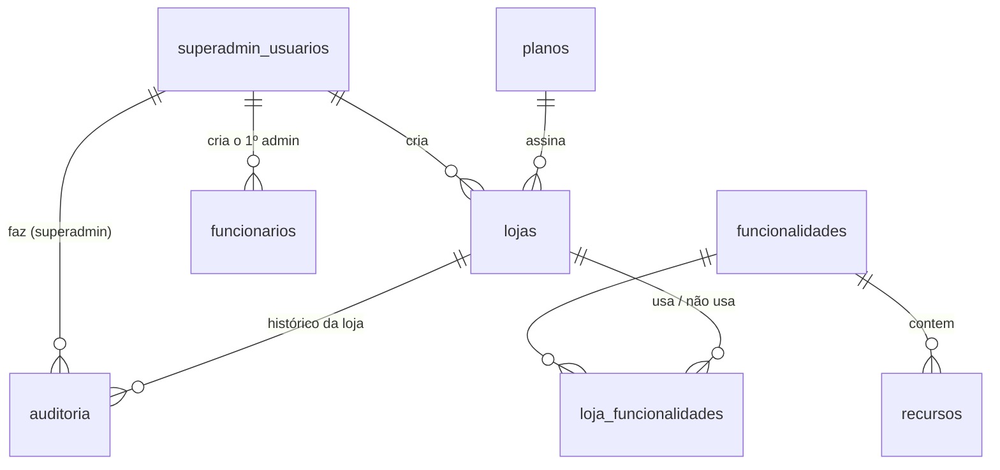
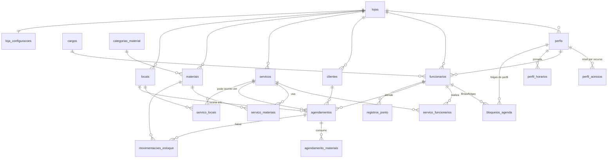

# Estrutura do Banco de Dados (PostgreSQL)

Planejamento do banco de dados para quando o back-end for criado. Este documento descreve **tabelas, colunas e relações**, além de algumas **regras de produto** anotadas ao longo do texto (marcadas com 📌).

O sistema é dividido em duas áreas:

1. **Plataforma (SUPERADMIN)**: gestão geral. Cria e edita lojas (incluindo o **tipo**), escolhe os módulos que cada loja usa, cria o primeiro funcionário das lojas, mantém os planos e consulta a auditoria. Tem sua **própria tabela de usuários** (usuários admin).
2. **Painel da Loja**: tudo o que uma loja (clínica, barbearia, escola...) usa no dia a dia (agenda, clientes, funcionários, serviços, materiais, ponto). **Toda tabela tem `loja_id`** e os dados de uma loja nunca se misturam com os de outra.

---

## Convenções

| Item | Padrão |
|---|---|
| Nomes | `snake_case`, tabelas no plural, em português |
| Chave primária | `id uuid DEFAULT gen_random_uuid()` |
| Datas/horas | `timestamptz` (sempre em UTC; exibição convertida pelo fuso da loja) |
| Datas sem hora | `date` |
| Valores monetários | `numeric(10,2)` |
| Colunas de controle | **Todas as tabelas** têm `criado_em`, `atualizado_em`, `excluido_em` e `excluido_por`. As tabelas da loja têm também `atualizado_por` (ver abaixo) |
| Exclusão | **Nunca há exclusão física.** Toda tabela tem `excluido_em` e `excluido_por` (ver abaixo). `ativo = false` continua existindo para "inativo, mas visível"; excluído some das telas |
| Multi-loja | Toda tabela do Painel da Loja tem `loja_id uuid NOT NULL REFERENCES lojas(id)` |

📌 **Isolamento entre lojas:** além do `loja_id` em todas as tabelas, as chaves estrangeiras internas da loja são **compostas** (`loja_id`, `id`). Assim o banco impede, por exemplo, que um agendamento da Loja A aponte para um cliente da Loja B. Para isso, cada tabela da loja tem `UNIQUE (loja_id, id)`.

```sql
-- exemplo
ALTER TABLE clientes ADD CONSTRAINT clientes_loja_id_uk UNIQUE (loja_id, id);

ALTER TABLE agendamentos
  ADD CONSTRAINT agendamentos_cliente_fk
  FOREIGN KEY (loja_id, cliente_id) REFERENCES clientes (loja_id, id);
```

📌 **Opcional (recomendado):** ativar **Row Level Security (RLS)** do Postgres nas tabelas da loja, filtrando por `loja_id = current_setting('app.loja_id')::uuid`. É uma segunda camada de proteção caso alguma consulta esqueça o filtro.

## Colunas de controle (todas as tabelas)

| Coluna | Tipo | Onde | Regra |
|---|---|---|---|
| `criado_em` | timestamptz | Todas as tabelas | `NOT NULL DEFAULT now()`. Nunca muda |
| `atualizado_em` | timestamptz | Todas as tabelas | `NOT NULL DEFAULT now()`. Atualizado por trigger em todo `UPDATE` |
| `atualizado_por` | uuid | Todas as tabelas do **Painel da Loja** (seção 2) | FK (`loja_id`, `atualizado_por`) → `funcionarios`. Funcionário que fez a **última** alteração na linha (no `INSERT`, é quem criou) |
| `excluido_em` | timestamptz | Todas as tabelas | NULL = linha não excluída. Preenchido com a **hora exata** da exclusão |
| `excluido_por` | uuid | Todas as tabelas | Quem excluiu. Tabelas da loja: FK (`loja_id`, `excluido_por`) → `funcionarios`. Tabelas da plataforma: FK → `superadmin_usuarios` |

📌 `atualizado_por` é preenchido pelo próprio banco, a partir do funcionário logado que o back-end informa no início de cada transação. Assim nenhuma rota esquece de gravar:

```sql
-- back-end, no início de cada requisição da loja
SET LOCAL app.funcionario_id = '<id do funcionário logado>';

-- todas as tabelas
CREATE FUNCTION registrar_alteracao() RETURNS trigger AS $$
BEGIN
  NEW.atualizado_em := now();
  RETURN NEW;
END $$ LANGUAGE plpgsql;

-- tabelas da loja
CREATE FUNCTION registrar_alteracao_loja() RETURNS trigger AS $$
BEGIN
  NEW.atualizado_em  := now();
  NEW.atualizado_por := nullif(current_setting('app.funcionario_id', true), '')::uuid;
  RETURN NEW;
END $$ LANGUAGE plpgsql;

-- exemplo
CREATE TRIGGER agendamentos_alteracao BEFORE INSERT OR UPDATE ON agendamentos
  FOR EACH ROW EXECUTE FUNCTION registrar_alteracao_loja();
```

📌 Quando a alteração numa tabela da loja é feita pelo **superadmin** (ex.: criar o primeiro funcionário) ou por uma rotina automática, `atualizado_por` / `excluido_por` ficam **NULL**. Quem foi fica registrado na `auditoria` (1.9), que guarda o `superadmin_id`.

📌 Nas tabelas da plataforma (seção 1) `excluido_por` aponta para `superadmin_usuarios`. `lojas` e `loja_funcionalidades` também guardam o último superadmin que alterou.

📌 `atualizado_por` guarda apenas a **última** alteração. O histórico completo (antes e depois de cada alteração, de todas as tabelas) fica na `auditoria` (1.9).

## Exclusão lógica (todas as tabelas)

📌 **Nada é apagado de verdade.** "Excluir" na tela grava `excluido_em = now()` e `excluido_por = <funcionário logado>`. A linha some das telas e da API, mas continua no banco e na auditoria.

📌 O próprio banco garante isso: um trigger `BEFORE DELETE` transforma qualquer `DELETE` em `UPDATE`, então nenhuma rota consegue apagar por engano.

```sql
CREATE FUNCTION excluir_logicamente() RETURNS trigger AS $$
BEGIN
  EXECUTE format(
    'UPDATE %I.%I SET excluido_em = now(),
            excluido_por = nullif(current_setting(''app.funcionario_id'', true), '''')::uuid
      WHERE id = $1 AND excluido_em IS NULL',
    TG_TABLE_SCHEMA, TG_TABLE_NAME) USING OLD.id;
  RETURN NULL; -- cancela o DELETE físico
END $$ LANGUAGE plpgsql;

-- exemplo
CREATE TRIGGER clientes_excluir BEFORE DELETE ON clientes
  FOR EACH ROW EXECUTE FUNCTION excluir_logicamente();
```

(Nas tabelas da plataforma, a função lê `app.superadmin_id`. Nas tabelas de ligação, sem `id`, o `WHERE` usa a chave composta.)

📌 **Consultas:** toda leitura filtra `excluido_em IS NULL`. Para não depender de cada rota lembrar, cada tabela tem uma *view* com esse filtro (ex.: `clientes_ativos`) ou uma política de RLS.

📌 **Unicidade:** como a linha excluída continua no banco, os `UNIQUE` das tabelas viram **índices únicos parciais**, que só valem para linhas não excluídas. Assim dá para cadastrar de novo um nome ou e-mail que já foi excluído.

```sql
-- em vez de UNIQUE (loja_id, nome)
CREATE UNIQUE INDEX servicos_nome_uk ON servicos (loja_id, nome) WHERE excluido_em IS NULL;
```

📌 **Tabelas de ligação** (chave primária composta, ex.: `servico_funcionarios`, `perfil_acessos`): religar um vínculo excluído **desfaz a exclusão** da linha existente (`excluido_em = NULL`) em vez de inserir outra. A auditoria guarda as duas operações.

📌 **Chaves estrangeiras** continuam válidas, pois a linha referenciada não some. Ex.: um agendamento antigo de um serviço excluído continua mostrando o serviço.

📌 Única exceção: a própria `auditoria` (1.9), que só recebe inserções e nunca é alterada nem excluída.

---

# 1. Plataforma (SUPERADMIN)

Área administrativa global, fora do contexto de qualquer loja. Ainda não existe no front-end.

O que o superadmin faz (menus do painel SUPERADMIN):

| Menu | Ação | Onde fica |
|---|---|---|
| Lojas | Criar e editar os **dados gerais da loja** (cadastro, endereço, **tipo**, plano, status) | `lojas` (1.6) |
| Lojas › Módulos | Escolher **quais módulos a loja usa**, um a um (Serviços, Materiais, Controle de Tempo, Locais). O que não é usado some do menu da loja | `loja_funcionalidades` (1.7) |
| Lojas › Funcionários | Criar o **primeiro Administrador** e dar suporte (editar, redefinir senha). O dia a dia de funcionários é feito na própria loja | `funcionarios` (2.4) |
| Planos | Manter os **planos comerciais** (nome e preço) | `planos` (1.3) |
| Usuários admin | Manter as **contas de superadmin**. Só isso: os usuários das lojas são cadastrados na loja | `superadmin_usuarios` (1.1) |
| Auditoria | Ver **o que mudou e quem fez**, sempre **uma loja por vez**: escolhe a loja, a tabela e o período | `auditoria` (1.9) |

Não são mantidos pelo painel (mudam junto com o código, por migração): o **tipo da loja** (1.2), o catálogo de **módulos** (1.4) e o de **recursos** (1.8).

## Diagrama



## 1.1 `superadmin_usuarios`

Usuários que administram a plataforma (menu **Usuários admin**). **Tabela separada** dos funcionários das lojas: um superadmin não é um funcionário e vice-versa. Este cadastro serve só para isso; usuários das lojas são criados na própria loja.

| Coluna | Tipo | Regras |
|---|---|---|
| id | uuid | PK |
| nome | varchar(150) | NOT NULL |
| email | varchar(150) | NOT NULL, único entre os não excluídos |
| senha_hash | varchar(255) | NOT NULL (bcrypt/argon2) |
| ativo | boolean | DEFAULT true |
| ultimo_login_em | timestamptz | |
| criado_em | timestamptz | NOT NULL DEFAULT now() |
| atualizado_em | timestamptz | NOT NULL DEFAULT now(). Atualizado automaticamente em todo UPDATE (trigger) |
| excluido_em | timestamptz | NULL = não excluído. Hora exata da exclusão |
| excluido_por | uuid | FK → superadmin_usuarios. Quem excluiu |

## 1.2 Tipo da loja (enum `tipo_loja`)

Tipo do negócio. **Não é tabela:** é uma constante do sistema (enum no banco e constante no back-end), gravada em `lojas.tipo`.

```sql
CREATE TYPE tipo_loja AS ENUM ('clinica', 'barbearia', 'escola');
```

| codigo | nome |
|---|---|
| `clinica` | Clínica |
| `barbearia` | Barbearia |
| `escola` | Escola |

📌 **Por que constante:** cada tipo tem o **próprio site do consumidor final**: layout, textos, fluxo de agendamento e apresentação mudam por inteiro (uma barbearia não parece uma clínica). Um tipo novo só faz sentido junto com o código desse site, então entra por migração (`ALTER TYPE tipo_loja ADD VALUE ...`), não por cadastro.

📌 **O tipo NÃO muda nada no Painel da Loja.** Ele não libera nem bloqueia módulos (isso é feito em `loja_funcionalidades`, 1.7) e não altera telas internas. Os textos internos que variam por loja (ex.: "Sala", "Cadeira") ficam em `loja_configuracoes` (2.21).

## 1.3 `planos`

Pacotes comerciais oferecidos às lojas. **Por enquanto só definem o valor cobrado.**

| Coluna | Tipo | Regras |
|---|---|---|
| id | uuid | PK |
| nome | varchar(80) | NOT NULL, único entre os não excluídos (ex.: Básico, Profissional) |
| descricao | text | |
| preco_mensal | numeric(10,2) | NOT NULL |
| ativo | boolean | DEFAULT true. Plano inativo não aparece para lojas novas |
| criado_em | timestamptz | NOT NULL DEFAULT now() |
| atualizado_em | timestamptz | NOT NULL DEFAULT now(). Atualizado automaticamente em todo UPDATE (trigger) |
| excluido_em | timestamptz | NULL = não excluído. Hora exata da exclusão |
| excluido_por | uuid | FK → superadmin_usuarios. Quem excluiu |

📌 **O plano não define nem limita módulos.** Os módulos (Serviços, Materiais, Controle de Tempo, Locais) são escolhidos **loja a loja** em `loja_funcionalidades` (1.7). A ideia é esconder o que a loja não vai usar, para o menu não ficar com itens sobrando, e não bloquear o que ela não pagou.

📌 **Futuro:** se um dia o plano passar a limitar algo (nº de funcionários, agendamentos por mês, módulos incluídos), entram colunas ou uma tabela `plano_limites` aqui. Hoje não existe nenhuma regra ligando plano e acesso.

## 1.4 `funcionalidades`

Catálogo dos **módulos** do sistema. Cada item do menu da loja corresponde a uma funcionalidade.

📌 Catálogo **fixo**, mantido por migração junto com o código (um módulo novo só existe se a tela existir). Não há tela de cadastro no painel SUPERADMIN.

| Coluna | Tipo | Regras |
|---|---|---|
| id | uuid | PK |
| codigo | varchar(50) | NOT NULL, UNIQUE |
| nome | varchar(100) | NOT NULL |
| descricao | text | |
| opcional | boolean | NOT NULL. `true` = o superadmin pode ativar/desativar por loja. `false` = módulo base, sempre ativo |
| ativo | boolean | DEFAULT true |
| criado_em | timestamptz | NOT NULL DEFAULT now() |
| atualizado_em | timestamptz | NOT NULL DEFAULT now(). Atualizado automaticamente em todo UPDATE (trigger) |
| excluido_em | timestamptz | NULL = não excluído. Hora exata da exclusão |
| excluido_por | uuid | FK → superadmin_usuarios. Quem excluiu |

Valores iniciais (mesmos menus do front-end):

| codigo | Menu | opcional |
|---|---|---|
| `inicio` | Início | não |
| `agenda` | Agenda e Agendamentos | não |
| `clientes` | Clientes | não |
| `funcionarios` | Funcionários | não |
| `configuracoes` | Configurações | não |
| `servicos` | Serviços | **sim** |
| `materiais` | Materiais | **sim** |
| `controle_tempo` | Controle de Tempo | **sim** |
| `locais` | Locais (salas, cadeiras, macas, links online...) | **sim** |

📌 Por enquanto só **Serviços, Materiais, Controle de Tempo e Locais** podem ser desativados. Para tornar outro módulo opcional no futuro, basta mudar `opcional` para `true`.

## 1.5 *(removida)* `plano_funcionalidades`

Não existe mais: o plano não sugere nem define módulos (ver 1.3). Os módulos da loja são escolhidos na criação e depois em **Lojas › Módulos** (1.7).

## 1.6 `lojas`

Cada negócio cliente da plataforma (clínica, barbearia, escola...). É o "tenant" de todo o Painel da Loja. **Criada pelo superadmin.** Parte dos dados também pode ser editada pela própria loja, no menu **Configurações** (ver 2.18).

| Coluna | Tipo | Regras |
|---|---|---|
| id | uuid | PK |
| tipo | enum `tipo_loja` | NOT NULL (ver 1.2). Define qual site do consumidor a loja usa |
| nome | varchar(150) | NOT NULL (razão social) |
| nome_fantasia | varchar(150) | Nome exibido da loja |
| cnpj | varchar(18) | Opcional. UNIQUE quando preenchido |
| logo_url | varchar(500) | Caminho do arquivo da logo no storage. NULL = sem logo |
| slug | varchar(60) | NOT NULL, único entre os não excluídos. Identifica a loja na URL/login (ex.: `clinica-sorriso`) |
| email | varchar(150) | |
| telefone | varchar(20) | |
| cep | varchar(9) | |
| logradouro | varchar(150) | |
| numero | varchar(10) | |
| complemento | varchar(80) | |
| bairro | varchar(80) | |
| cidade | varchar(80) | |
| uf | char(2) | |
| fuso_horario | varchar(50) | DEFAULT `'America/Sao_Paulo'` |
| plano_id | uuid | FK → planos |
| status | enum `status_loja` | `ativa`, `suspensa`, `cancelada`. DEFAULT `ativa` |
| criado_por | uuid | FK → superadmin_usuarios |
| atualizado_por_funcionario | uuid | FK → funcionarios. Última edição feita pela loja |
| atualizado_por_superadmin | uuid | FK → superadmin_usuarios. Última edição feita pelo superadmin |
| criado_em | timestamptz | NOT NULL DEFAULT now() |
| atualizado_em | timestamptz | NOT NULL DEFAULT now(). Atualizado automaticamente em todo UPDATE (trigger) |
| excluido_em | timestamptz | NULL = não excluído. Hora exata da exclusão |
| excluido_por | uuid | FK → superadmin_usuarios. Quem excluiu |

📌 Loja `suspensa`: funcionários não conseguem fazer login, mas os dados são mantidos. Loja `cancelada`: dados mantidos por período definido antes da remoção.

📌 Ao criar uma loja, o sistema cria automaticamente os **perfis padrão** (ver 2.1) e os registros de **`loja_funcionalidades`** com os módulos que o superadmin marcou (ver 1.7). No mesmo fluxo, o superadmin cadastra o **primeiro funcionário** com perfil Administrador.

## 1.7 `loja_funcionalidades`

**Define quais módulos opcionais a loja usa, um a um.** É a única fonte que define o que aparece para a loja (não depende do tipo nem do plano). O objetivo é **esconder o que a loja não usa**, para o menu não ter itens sobrando.

| Coluna | Tipo | Regras |
|---|---|---|
| loja_id | uuid | PK, FK → lojas |
| funcionalidade_id | uuid | PK, FK → funcionalidades (apenas as com `opcional = true`) |
| habilitado | boolean | NOT NULL |
| observacao | text | ex.: "liberado como cortesia até dez/2026" |
| expira_em | timestamptz | NULL = sem prazo. Ao vencer, o módulo é considerado desativado |
| atualizado_por | uuid | FK → superadmin_usuarios. Superadmin que fez a última alteração |
| criado_em | timestamptz | NOT NULL DEFAULT now() |
| atualizado_em | timestamptz | NOT NULL DEFAULT now(). Atualizado automaticamente em todo UPDATE (trigger) |
| excluido_em | timestamptz | NULL = não excluído. Hora exata da exclusão |
| excluido_por | uuid | FK → superadmin_usuarios. Quem excluiu |

📌 **Módulo ativo na loja** = funcionalidade com `opcional = false` **OU** registro com `habilitado = true` (e `expira_em` nula ou futura).

📌 **Na criação da loja**, o superadmin marca os módulos que a loja vai usar e é gerado um registro para cada módulo opcional (`habilitado` conforme a escolha). Depois disso ele liga/desliga à vontade em **Lojas › Módulos**. O plano não interfere.

📌 **Desativar um módulo não apaga dados.** O menu e as telas somem, a API recusa as chamadas daquele módulo, e ao reativar tudo volta como estava.

📌 Efeitos de cada módulo desativado:

| Módulo desativado | Efeito |
|---|---|
| Serviços | Agendamento é criado **sem serviço**: duração e preço informados manualmente (ver 2.13) |
| Materiais | Não há consumo de materiais nem baixa de estoque ao concluir atendimentos |
| Controle de Tempo | Funcionários não registram ponto |
| Locais | Agendamento é criado **sem local** (`local_id` NULL) e as regras de local (2.19, 2.20) não se aplicam |

## 1.8 `recursos`

Catálogo global das **áreas do sistema que podem ter nível de acesso** (nenhum, leitura ou escrita). Catálogo **fixo**, mantido por migração junto com o código (como 1.4). As lojas usam este catálogo para montar seus perfis (2.2).

| Coluna | Tipo | Regras |
|---|---|---|
| id | uuid | PK |
| funcionalidade_id | uuid | NOT NULL, FK → funcionalidades |
| codigo | varchar(50) | NOT NULL, UNIQUE |
| nome | varchar(100) | NOT NULL (texto exibido na tela de perfis) |
| descricao | text | Texto "Leitura: ... Escrita: ..." (mantido por compatibilidade) |
| leitura | varchar(200) | NOT NULL. O que o nível leitura permite (coluna "Leitura permite" abaixo) |
| escrita | varchar(200) | NOT NULL. O que o nível escrita permite (coluna "Escrita permite" abaixo) |
| ordem | smallint | ordem de exibição |
| criado_em | timestamptz | NOT NULL DEFAULT now() |
| atualizado_em | timestamptz | NOT NULL DEFAULT now(). Atualizado automaticamente em todo UPDATE (trigger) |
| excluido_em | timestamptz | NULL = não excluído. Hora exata da exclusão |
| excluido_por | uuid | FK → superadmin_usuarios. Quem excluiu |

Valores iniciais:

| codigo | Nome | Módulo | **Leitura** permite | **Escrita** permite |
|---|---|---|---|---|
| `agenda_propria` | Minha agenda | agenda | Ver os próprios agendamentos | Criar, remarcar, mudar status e cancelar os próprios |
| `agenda_equipe` | Agenda da equipe | agenda | Ver agendamentos de todos | Criar, remarcar, mudar status e cancelar de qualquer profissional |
| `config_agendamentos` | Horários e bloqueios | agenda | Ver a jornada dos perfis e os bloqueios | Editar a jornada dos perfis (2.5), bloqueios, folgas e feriados (2.6) |
| `clientes` | Clientes | clientes | Ver lista e ficha | Cadastrar, editar, inativar |
| `funcionarios` | Funcionários | funcionarios | Ver lista | Cadastrar, editar, inativar, definir cargo e perfil |
| `perfis_acesso` | Perfis de acesso | funcionarios | Ver perfis e seus níveis | Criar e editar perfis e níveis |
| `servicos` | Serviços | servicos | Ver serviços | Cadastrar, editar, vincular profissionais e materiais |
| `materiais` | Materiais | materiais | Ver estoque e movimentações | Cadastrar, editar, lançar entradas, ajustes e perdas |
| `locais` | Locais | locais | Ver salas, cadeiras, links online... | Cadastrar, editar, inativar e definir como a loja chama os locais (2.21) |
| `ponto_proprio` | Meu ponto | controle_tempo | Ver os próprios registros | Registrar entrada e saída |
| `ponto_equipe` | Ponto da equipe | controle_tempo | Ver registros de todos | Corrigir registros (com justificativa) |
| `config_loja` | Dados da loja | configuracoes | Ver logo, nome, contato, endereço e CNPJ | Editar esses dados (ver 2.18) |

📌 Um recurso só tem efeito se o módulo dele estiver ativo na loja. Módulo desativado = nível `nenhum` para todos, inclusive o Administrador.

## 1.9 `auditoria`

**Histórico completo de alterações de todas as tabelas** (loja e plataforma): uma linha para cada inclusão, alteração ou exclusão, com os valores antes e depois e quem fez. Substitui as antigas `superadmin_auditoria` e `agendamento_historico`.

| Coluna | Tipo | Regras |
|---|---|---|
| id | bigserial | PK |
| loja_id | uuid | FK → lojas. NULL = tabela da plataforma (`planos`, `superadmin_usuarios`) |
| tabela | varchar(60) | NOT NULL. Nome da tabela alterada (ex.: `agendamentos`) |
| registro_id | text | NOT NULL. Chave da linha alterada (uuid, ou a chave composta em texto nas tabelas de ligação) |
| operacao | enum `operacao_auditoria` | NOT NULL. `inserir`, `alterar`, `excluir`, `restaurar` |
| antes | jsonb | Linha antes da alteração. NULL em `inserir` |
| depois | jsonb | Linha depois da alteração. Em `excluir`, a linha com `excluido_em` preenchido |
| campos_alterados | text[] | Colunas que mudaram (só em `alterar`), para filtrar sem abrir o jsonb |
| funcionario_id | uuid | FK (loja_id, funcionario_id) → funcionarios. Quem fez, quando foi alguém da loja |
| superadmin_id | uuid | FK → superadmin_usuarios. Quem fez, quando foi um superadmin |
| origem | enum `origem_auditoria` | NOT NULL. `painel`, `superadmin`, `site` (cliente final), `sistema` (rotina automática) |
| ip | inet | |
| criado_em | timestamptz | NOT NULL DEFAULT now(). Hora exata da alteração |

📌 **Preenchida pelo banco**, por um trigger `AFTER INSERT OR UPDATE` genérico ligado a todas as tabelas. O back-end só informa quem está logado no início da transação (`SET LOCAL app.funcionario_id`, `app.superadmin_id`, `app.origem`), como já faz para `atualizado_por`. Assim nenhuma rota esquece de registrar:

```sql
CREATE FUNCTION registrar_auditoria() RETURNS trigger AS $$
DECLARE
  op operacao_auditoria;
BEGIN
  op := CASE
    WHEN TG_OP = 'INSERT' THEN 'inserir'
    WHEN OLD.excluido_em IS NULL AND NEW.excluido_em IS NOT NULL THEN 'excluir'
    WHEN OLD.excluido_em IS NOT NULL AND NEW.excluido_em IS NULL THEN 'restaurar'
    ELSE 'alterar'
  END;
  INSERT INTO auditoria (loja_id, tabela, registro_id, operacao, antes, depois,
                         funcionario_id, superadmin_id, origem)
  VALUES (
    CASE WHEN TG_TABLE_NAME = 'lojas' THEN NEW.id ELSE (to_jsonb(NEW) ->> 'loja_id')::uuid END,
    TG_TABLE_NAME, to_jsonb(NEW) ->> 'id', op,
    CASE WHEN TG_OP = 'UPDATE' THEN to_jsonb(OLD) END, to_jsonb(NEW),
    nullif(current_setting('app.funcionario_id', true), '')::uuid,
    nullif(current_setting('app.superadmin_id', true), '')::uuid,
    coalesce(nullif(current_setting('app.origem', true), ''), 'sistema')::origem_auditoria
  );
  RETURN NULL;
END $$ LANGUAGE plpgsql;

-- exemplo
CREATE TRIGGER agendamentos_auditoria AFTER INSERT OR UPDATE ON agendamentos
  FOR EACH ROW EXECUTE FUNCTION registrar_auditoria();
```

(Como não há `DELETE` físico, as exclusões chegam aqui como `UPDATE` de `excluido_em`.)

📌 **Tela Auditoria (SUPERADMIN):** sempre **uma loja por vez**. O superadmin escolhe a loja (ou "Plataforma"), a **tabela** e o **período** (hoje, últimos 7/30/90 dias, último ano ou intervalo livre) e vê: quando, quem (funcionário, superadmin ou cliente pelo site), operação, qual registro e o que mudou (campo: antes → depois). Pode filtrar por pessoa. A mesma visão aparece na aba **Histórico** do detalhe da loja.

📌 **Somente inserção:** a tabela não tem `atualizado_*` nem `excluido_*`; ninguém altera nem apaga histórico (permissão de `UPDATE`/`DELETE` revogada para o usuário da aplicação).

📌 **Login não é alteração:** registrar o acesso (`ultimo_login_em`) e o novo hash da mesma senha (quando o algoritmo pede) não entram na auditoria nem mudam `atualizado_em`/`atualizado_por`. A transação do login é marcada (`app.login`) e só um UPDATE que mexe **apenas** nessas duas colunas é ignorado; a troca de senha de verdade continua auditada.

📌 Índice que atende a consulta da tela:

```sql
CREATE INDEX ON auditoria (loja_id, tabela, criado_em DESC);
```

📌 **Volume:** é a maior tabela do sistema. Se crescer muito, particionar por mês (`PARTITION BY RANGE (criado_em)`) e definir por quanto tempo guardar.

📌 Ações sem alteração de linha (ex.: superadmin "entrar como" a loja para suporte, enviar link de nova senha) também entram aqui, com o detalhe em `depois`.

---

# 2. Painel da Loja

Todas as tabelas abaixo têm `loja_id`. Cobrem tudo o que o front-end atual usa.

## Diagrama



## 2.1 `perfis`

Perfis dos funcionários dentro da loja. Cada perfil define, para cada recurso (1.8), um nível: **nenhum**, **leitura** ou **escrita** (2.2), e também a **jornada semanal** (2.5) e os bloqueios do grupo (2.6). Cada funcionário tem um perfil: é vinculado **uma vez só** e herda dele acessos e horários.

📌 Funcionários com o mesmo acesso mas horários diferentes ficam em perfis diferentes (ex.: "Profissional · manhã" e "Profissional · tarde"). Ao criar um perfil, a tela permite copiar os níveis e a jornada de outro.

| Coluna | Tipo | Regras |
|---|---|---|
| id | uuid | PK |
| loja_id | uuid | FK → lojas |
| nome | varchar(60) | NOT NULL, UNIQUE (loja_id, nome) |
| descricao | text | |
| padrao | boolean | DEFAULT false. Perfis criados automaticamente não podem ser excluídos |
| acesso_total | boolean | DEFAULT false. `true` só no Administrador: escrita em tudo, não editável |
| criado_em | timestamptz | NOT NULL DEFAULT now() |
| atualizado_em | timestamptz | NOT NULL DEFAULT now(). Atualizado automaticamente em todo UPDATE (trigger) |
| atualizado_por | uuid | FK (loja_id, atualizado_por) → funcionarios. Funcionário que fez a última alteração na linha |
| excluido_em | timestamptz | NULL = não excluído. Hora exata da exclusão |
| excluido_por | uuid | FK (loja_id, excluido_por) → funcionarios. Quem excluiu |

Perfis padrão criados com a loja (a loja pode editar Recepção e Profissional e criar outros):

| Recurso | Administrador | Recepção | Profissional |
|---|---|---|---|
| Minha agenda | escrita | escrita | escrita |
| Agenda da equipe | escrita | escrita | nenhum |
| Horários e bloqueios | escrita | leitura | nenhum |
| Clientes | escrita | escrita | leitura |
| Funcionários | escrita | nenhum | nenhum |
| Perfis de acesso | escrita | nenhum | nenhum |
| Serviços | escrita | leitura | nenhum |
| Materiais | escrita | nenhum | nenhum |
| Locais | escrita | leitura | nenhum |
| Meu ponto | escrita | escrita | escrita |
| Ponto da equipe | escrita | nenhum | nenhum |
| Dados da loja | escrita | nenhum | nenhum |

## 2.2 `perfil_acessos`

Nível de acesso de cada perfil em cada recurso.

| Coluna | Tipo | Regras |
|---|---|---|
| loja_id | uuid | |
| perfil_id | uuid | PK, FK (loja_id, perfil_id) → perfis |
| recurso_id | uuid | PK, FK → recursos (catálogo global, 1.8) |
| nivel | enum `nivel_acesso` | NOT NULL. `nenhum`, `leitura`, `escrita` |
| criado_em | timestamptz | NOT NULL DEFAULT now() |
| atualizado_em | timestamptz | NOT NULL DEFAULT now(). Atualizado automaticamente em todo UPDATE (trigger) |
| atualizado_por | uuid | FK (loja_id, atualizado_por) → funcionarios. Funcionário que fez a última alteração na linha |
| excluido_em | timestamptz | NULL = não excluído. Hora exata da exclusão |
| excluido_por | uuid | FK (loja_id, excluido_por) → funcionarios. Quem excluiu |

📌 **Níveis:**
- `nenhum`: o item não aparece no menu e a API responde 403.
- `leitura`: vê, mas não altera (botões de criar/editar/excluir ficam ocultos).
- `escrita`: vê e altera. **Escrita inclui leitura.**

📌 Recurso **sem linha** nesta tabela = `nenhum`. Assim, um recurso novo adicionado ao catálogo começa bloqueado para todos os perfis, exceto o Administrador.

📌 **Nível efetivo** = nível do perfil, **mas** `nenhum` se o módulo do recurso estiver desativado na loja (1.7).

📌 **Sem escalada de acesso:** quem tem escrita em *Funcionários* mas não em *Perfis de acesso* só pode atribuir perfis existentes, e nunca o perfil Administrador. Só o Administrador (ou o superadmin) atribui o perfil Administrador.

📌 Listas de apoio usadas em formulários (ex.: escolher serviço e profissional ao criar um agendamento) são liberadas para quem pode criar agendamentos, mesmo sem leitura em *Serviços* ou *Funcionários*. Só os dados necessários (id, nome) são retornados.

## 2.3 `cargos`

Cargos/especialidades da loja (no front-end: Dentista, Fisioterapeuta, Recepcionista...). **Cargo é informativo**; quem define o acesso é o **perfil**.

| Coluna | Tipo | Regras |
|---|---|---|
| id | uuid | PK |
| loja_id | uuid | FK → lojas |
| nome | varchar(80) | NOT NULL, UNIQUE (loja_id, nome) |
| ativo | boolean | DEFAULT true |
| criado_em | timestamptz | NOT NULL DEFAULT now() |
| atualizado_em | timestamptz | NOT NULL DEFAULT now(). Atualizado automaticamente em todo UPDATE (trigger) |
| atualizado_por | uuid | FK (loja_id, atualizado_por) → funcionarios. Funcionário que fez a última alteração na linha |
| excluido_em | timestamptz | NULL = não excluído. Hora exata da exclusão |
| excluido_por | uuid | FK (loja_id, excluido_por) → funcionarios. Quem excluiu |

## 2.4 `funcionarios`

Funcionários da loja. **São também os usuários que fazem login no Painel da Loja.**

| Coluna | Tipo | Regras |
|---|---|---|
| id | uuid | PK |
| loja_id | uuid | FK → lojas |
| perfil_id | uuid | NOT NULL, FK (loja_id, perfil_id) → perfis |
| cargo_id | uuid | FK (loja_id, cargo_id) → cargos |
| nome | varchar(150) | NOT NULL |
| cpf | varchar(14) | UNIQUE (loja_id, cpf) quando preenchido. Dígito verificador conferido; gravado como `000.000.000-00` |
| email | varchar(150) | NOT NULL, UNIQUE (loja_id, email). Usado no login |
| senha_hash | varchar(255) | NOT NULL |
| telefone | varchar(20) | Com DDD; gravado como `(11) 98888-1111` |
| cor_agenda | varchar(7) | cor do profissional no calendário (ex.: `#0f766e`) |
| ativo | boolean | DEFAULT true |
| ultimo_login_em | timestamptz | |
| criado_por_funcionario | uuid | FK → funcionarios. Preenchido quando criado dentro da loja |
| criado_por_superadmin | uuid | FK → superadmin_usuarios. Preenchido quando criado pelo superadmin |
| criado_em | timestamptz | NOT NULL DEFAULT now() |
| atualizado_em | timestamptz | NOT NULL DEFAULT now(). Atualizado automaticamente em todo UPDATE (trigger) |
| atualizado_por | uuid | FK (loja_id, atualizado_por) → funcionarios. Funcionário que fez a última alteração na linha |
| excluido_em | timestamptz | NULL = não excluído. Hora exata da exclusão |
| excluido_por | uuid | FK (loja_id, excluido_por) → funcionarios. Quem excluiu |

📌 **Quem cria funcionários:** no dia a dia, a própria loja (quem tem **escrita** em *Funcionários*). O **superadmin** cria o primeiro Administrador junto com a loja e pode criar/editar funcionários para dar suporte. Exatamente uma das colunas `criado_por_*` é preenchida. Tudo vai para a `auditoria` (1.9).

📌 O superadmin também pode editar, inativar e redefinir a senha de qualquer funcionário.

📌 **Login:** como o e-mail é único **por loja**, o login precisa identificar a loja (pelo `slug` na URL ou num campo do formulário).

📌 Funcionário **inativo** não faz login, não aparece para novos agendamentos e não registra ponto, mas o histórico dele é mantido.

📌 Não é possível desativar o **último administrador** ativo da loja.

## 2.5 `perfil_horarios`

Jornada semanal do **perfil**. Todo funcionário do perfil pode ser agendado nestes horários; trocar o funcionário de perfil troca também a jornada dele.

| Coluna | Tipo | Regras |
|---|---|---|
| id | uuid | PK |
| loja_id | uuid | |
| perfil_id | uuid | NOT NULL, FK (loja_id, perfil_id) → perfis ON DELETE CASCADE |
| dia_semana | smallint | 0 = domingo ... 6 = sábado |
| hora_inicio | time | NOT NULL |
| hora_fim | time | NOT NULL, CHECK (hora_fim > hora_inicio) |
| criado_em | timestamptz | NOT NULL DEFAULT now() |
| atualizado_em | timestamptz | NOT NULL DEFAULT now(). Atualizado automaticamente em todo UPDATE (trigger) |
| atualizado_por | uuid | FK (loja_id, atualizado_por) → funcionarios. Funcionário que fez a última alteração na linha |
| excluido_em | timestamptz | NULL = não excluído. Hora exata da exclusão |
| excluido_por | uuid | FK (loja_id, excluido_por) → funcionarios. Quem excluiu |

📌 Pode haver mais de uma faixa no mesmo dia (ex.: 08:00–12:00 e 13:00–18:00, com intervalo de almoço).

## 2.6 `bloqueios_agenda`

Períodos em que **não** se pode agendar (feriado, folga do grupo, férias, compromisso). Vale para a loja inteira, para um perfil ou para um funcionário.

| Coluna | Tipo | Regras |
|---|---|---|
| id | uuid | PK |
| loja_id | uuid | |
| perfil_id | uuid | FK (loja_id, perfil_id) → perfis ON DELETE CASCADE. Bloqueio de todos os funcionários do perfil |
| funcionario_id | uuid | FK (loja_id, funcionario_id) → funcionarios. Bloqueio só desse funcionário (férias, consulta médica) |
| inicio | timestamptz | NOT NULL |
| fim | timestamptz | NOT NULL, CHECK (fim > inicio) |
| motivo | varchar(150) | |
| criado_por | uuid | FK → funcionarios |
| criado_em | timestamptz | NOT NULL DEFAULT now() |
| atualizado_em | timestamptz | NOT NULL DEFAULT now(). Atualizado automaticamente em todo UPDATE (trigger) |
| atualizado_por | uuid | FK (loja_id, atualizado_por) → funcionarios. Funcionário que fez a última alteração na linha |
| excluido_em | timestamptz | NULL = não excluído. Hora exata da exclusão |
| excluido_por | uuid | FK (loja_id, excluido_por) → funcionarios. Quem excluiu |

📌 `CHECK (perfil_id IS NULL OR funcionario_id IS NULL)`: no máximo um dos dois. Os dois NULL = loja inteira (ex.: feriado).

📌 Um funcionário está bloqueado quando há bloqueio da loja inteira, do perfil dele ou dele próprio.

📌 Jornadas (2.5) e bloqueios ficam na tela **Configurações › Perfis e horários** e só são alterados por quem tem **escrita** em *Horários e bloqueios*.

## 2.7 `clientes`

| Coluna | Tipo | Regras |
|---|---|---|
| id | uuid | PK |
| loja_id | uuid | FK → lojas |
| nome | varchar(60) | NOT NULL. Só o primeiro nome: é como a loja chama o cliente ("Olá, Maria") |
| sobrenome | varchar(100) | NOT NULL |
| cpf | varchar(14) | UNIQUE (loja_id, cpf) quando preenchido. Dígito verificador conferido; gravado sempre como `000.000.000-00` |
| telefone | varchar(20) | NOT NULL. Com DDD (10 ou 11 dígitos); gravado sempre como `(11) 98888-1111` |
| email | varchar(150) | |
| data_nascimento | date | entre 1900-01-01 e hoje |
| observacoes | text | alergias, preferências etc. |
| canais | `canal_cliente[]` | NOT NULL DEFAULT `'{}'`. Por onde o cliente fala com a loja; pode ter mais de um: `loja`, `whatsapp`, `site` |
| ativo | boolean | DEFAULT true |
| criado_em | timestamptz | NOT NULL DEFAULT now() |
| atualizado_em | timestamptz | NOT NULL DEFAULT now(). Atualizado automaticamente em todo UPDATE (trigger) |
| atualizado_por | uuid | FK (loja_id, atualizado_por) → funcionarios. Funcionário que fez a última alteração na linha |
| excluido_em | timestamptz | NULL = não excluído. Hora exata da exclusão |
| excluido_por | uuid | FK (loja_id, excluido_por) → funcionarios. Quem excluiu |

📌 O mesmo cliente (mesma pessoa) em duas lojas diferentes gera **dois registros independentes**. Uma loja não vê os clientes da outra.

📌 **Nome e sobrenome separados** em todo cadastro (painel e site). Listas e buscas usam o nome completo (`nome || ' ' || sobrenome`); mensagens ao cliente usam só o `nome`.

📌 Cliente com agendamentos não é excluído fisicamente, apenas inativado.

📌 **Canais:** quem se cadastra pelo site entra com `site`. Se o telefone já existir na loja, o cadastro é reaproveitado e ganha o canal `site`. No painel, cada canal aparece como um ícone (loja, WhatsApp, site).

## 2.8 `servicos`

| Coluna | Tipo | Regras |
|---|---|---|
| id | uuid | PK |
| loja_id | uuid | FK → lojas |
| nome | varchar(120) | NOT NULL, UNIQUE (loja_id, nome) |
| descricao | text | |
| duracao_minutos | integer | NOT NULL, CHECK (> 0) |
| preco | numeric(10,2) | |
| ativo | boolean | DEFAULT true |
| criado_em | timestamptz | NOT NULL DEFAULT now() |
| atualizado_em | timestamptz | NOT NULL DEFAULT now(). Atualizado automaticamente em todo UPDATE (trigger) |
| atualizado_por | uuid | FK (loja_id, atualizado_por) → funcionarios. Funcionário que fez a última alteração na linha |
| excluido_em | timestamptz | NULL = não excluído. Hora exata da exclusão |
| excluido_por | uuid | FK (loja_id, excluido_por) → funcionarios. Quem excluiu |

## 2.9 `servico_funcionarios`

Quais profissionais podem realizar cada serviço.

| Coluna | Tipo | Regras |
|---|---|---|
| loja_id | uuid | |
| servico_id | uuid | PK, FK (loja_id, servico_id) → servicos |
| funcionario_id | uuid | PK, FK (loja_id, funcionario_id) → funcionarios |
| criado_em | timestamptz | NOT NULL DEFAULT now() |
| atualizado_em | timestamptz | NOT NULL DEFAULT now(). Atualizado automaticamente em todo UPDATE (trigger) |
| atualizado_por | uuid | FK (loja_id, atualizado_por) → funcionarios. Funcionário que fez a última alteração na linha |
| excluido_em | timestamptz | NULL = não excluído. Hora exata da exclusão |
| excluido_por | uuid | FK (loja_id, excluido_por) → funcionarios. Quem excluiu |

📌 Todo serviço ativo precisa ter **pelo menos um** profissional vinculado (validado no back-end).

📌 Um agendamento só pode ser criado se o par (serviço, profissional) existir nesta tabela.

## 2.10 `categorias_material`

| Coluna | Tipo | Regras |
|---|---|---|
| id | uuid | PK |
| loja_id | uuid | FK → lojas |
| nome | varchar(80) | NOT NULL, UNIQUE (loja_id, nome) |
| criado_em | timestamptz | NOT NULL DEFAULT now() |
| atualizado_em | timestamptz | NOT NULL DEFAULT now(). Atualizado automaticamente em todo UPDATE (trigger) |
| atualizado_por | uuid | FK (loja_id, atualizado_por) → funcionarios. Funcionário que fez a última alteração na linha |
| excluido_em | timestamptz | NULL = não excluído. Hora exata da exclusão |
| excluido_por | uuid | FK (loja_id, excluido_por) → funcionarios. Quem excluiu |

## 2.11 `materiais`

| Coluna | Tipo | Regras |
|---|---|---|
| id | uuid | PK |
| loja_id | uuid | FK → lojas |
| categoria_id | uuid | FK (loja_id, categoria_id) → categorias_material |
| nome | varchar(150) | NOT NULL, UNIQUE (loja_id, nome) |
| unidade | varchar(10) | NOT NULL (un, cx, pct, ml...) |
| quantidade_atual | numeric(10,2) | NOT NULL DEFAULT 0 |
| estoque_minimo | numeric(10,2) | DEFAULT 0 |
| ativo | boolean | DEFAULT true |
| criado_em | timestamptz | NOT NULL DEFAULT now() |
| atualizado_em | timestamptz | NOT NULL DEFAULT now(). Atualizado automaticamente em todo UPDATE (trigger) |
| atualizado_por | uuid | FK (loja_id, atualizado_por) → funcionarios. Funcionário que fez a última alteração na linha |
| excluido_em | timestamptz | NULL = não excluído. Hora exata da exclusão |
| excluido_por | uuid | FK (loja_id, excluido_por) → funcionarios. Quem excluiu |

📌 `quantidade_atual` **nunca é alterada diretamente**: só muda através de um registro em `movimentacoes_estoque` (na mesma transação). Assim, todo o histórico do estoque fica rastreável.

📌 Material com `quantidade_atual < estoque_minimo` aparece como **"Repor"** (tela de Materiais e tela Início).

## 2.12 `servico_materiais`

Materiais consumidos por **um** atendimento do serviço.

| Coluna | Tipo | Regras |
|---|---|---|
| loja_id | uuid | |
| servico_id | uuid | PK, FK (loja_id, servico_id) → servicos |
| material_id | uuid | PK, FK (loja_id, material_id) → materiais |
| quantidade | numeric(10,2) | NOT NULL, CHECK (> 0) |
| criado_em | timestamptz | NOT NULL DEFAULT now() |
| atualizado_em | timestamptz | NOT NULL DEFAULT now(). Atualizado automaticamente em todo UPDATE (trigger) |
| atualizado_por | uuid | FK (loja_id, atualizado_por) → funcionarios. Funcionário que fez a última alteração na linha |
| excluido_em | timestamptz | NULL = não excluído. Hora exata da exclusão |
| excluido_por | uuid | FK (loja_id, excluido_por) → funcionarios. Quem excluiu |

## 2.13 `agendamentos`

| Coluna | Tipo | Regras |
|---|---|---|
| id | uuid | PK |
| loja_id | uuid | FK → lojas |
| cliente_id | uuid | NOT NULL, FK (loja_id, cliente_id) → clientes |
| servico_id | uuid | FK (loja_id, servico_id) → servicos. Obrigatório quando o módulo Serviços está ativo (validado no back-end) |
| funcionario_id | uuid | NOT NULL, FK (loja_id, funcionario_id) → funcionarios |
| local_id | uuid | FK (loja_id, local_id) → locais. Obrigatório quando o módulo Locais está ativo (validado no back-end) |
| link_reuniao | varchar(500) | Link deste atendimento online. Vazio = usa `locais.link_padrao` |
| inicio | timestamptz | NOT NULL |
| fim | timestamptz | NOT NULL, CHECK (fim > inicio) |
| preco | numeric(10,2) | cópia do preço do serviço no momento do agendamento |
| status | enum `status_agendamento` | `pendente`, `agendado`, `confirmado`, `concluido`, `cancelado`, `nao_compareceu` |
| origem | enum `origem_agendamento` | `painel`, `site`. DEFAULT `painel` |
| observacoes | text | |
| motivo_cancelamento | text | obrigatório quando `status = cancelado` |
| criado_por | uuid | FK → funcionarios |
| criado_em | timestamptz | NOT NULL DEFAULT now() |
| atualizado_em | timestamptz | NOT NULL DEFAULT now(). Atualizado automaticamente em todo UPDATE (trigger) |
| atualizado_por | uuid | FK (loja_id, atualizado_por) → funcionarios. Funcionário que fez a última alteração na linha |
| excluido_em | timestamptz | NULL = não excluído. Hora exata da exclusão |
| excluido_por | uuid | FK (loja_id, excluido_por) → funcionarios. Quem excluiu |

📌 **Duração:** `fim` é calculado como `inicio + servicos.duracao_minutos`, mas pode ser ajustado manualmente (o front-end permite alterar a duração). Com o módulo **Serviços desativado**, não há serviço: duração e preço são informados manualmente e a regra de `servico_funcionarios` não se aplica.

📌 **Preço congelado:** se o preço do serviço mudar depois, o agendamento mantém o valor combinado.

📌 **Sem conflito de horário:** um profissional não pode ter dois agendamentos ativos sobrepostos. O próprio Postgres garante isso:

```sql
CREATE EXTENSION IF NOT EXISTS btree_gist;

ALTER TABLE agendamentos ADD CONSTRAINT agendamentos_sem_conflito
  EXCLUDE USING gist (
    funcionario_id WITH =,
    tstzrange(inicio, fim) WITH &&
  )
  WHERE (status NOT IN ('cancelado', 'nao_compareceu'));
```

📌 **Sem conflito de local:** a mesma regra vale para o local (a sala 101 não recebe duas aulas ao mesmo tempo). Agendamentos sem local não entram na verificação. Pedidos `pendente` do site também ocupam o local.

```sql
ALTER TABLE agendamentos ADD CONSTRAINT agendamentos_local_sem_conflito
  EXCLUDE USING gist (
    local_id WITH =,
    tstzrange(inicio, fim) WITH &&
  )
  WHERE (local_id IS NOT NULL AND status NOT IN ('cancelado', 'nao_compareceu'));
```

📌 **Local do agendamento:** com o módulo **Locais** ativo, o local precisa ser permitido para o serviço (ver 2.20) e estar ativo. A coluna fica nullable porque o módulo pode ser ligado ou desligado a qualquer momento, e os agendamentos antigos continuam válidos. Com o módulo **Serviços** desativado, qualquer local ativo serve.

📌 **Disponibilidade:** o back-end só aceita agendamentos dentro da jornada do perfil do profissional (`perfil_horarios`) e fora dos `bloqueios_agenda`. No site do consumidor, com o módulo Locais ativo, um horário só é oferecido se também houver um local permitido livre; o pedido já sai com esse local.

📌 **Visibilidade:** funcionário com acesso apenas em *Minha agenda* (perfil Profissional) só vê agendamentos onde `funcionario_id` é ele mesmo. Com leitura em *Agenda da equipe* (Recepção, Administrador), vê todos. Em cada caso, **leitura** só vê e **escrita** pode criar, remarcar, mudar status e cancelar.

📌 **Fluxo de status:**

```
pendente (site) ──► confirmado (loja aceitou)
   └──────────────► cancelado (loja recusou)

agendado ──► confirmado ──► concluido
   │              │
   └──────────────┴──► cancelado / nao_compareceu
```

- Pedidos feitos pelo **site do consumidor** entram como `pendente` e já **ocupam o horário** (não aparecem como livres para outro cliente). Quem tem escrita na agenda aceita (`confirmado`) ou recusa (`cancelado`, com motivo).
- `concluido`, `cancelado` e `nao_compareceu` são finais (só o Administrador pode reabrir).
- Ao ir para `concluido`: dá baixa nos materiais (ver 2.14 e 2.15), somente se o módulo **Materiais** estiver ativo.

Índices sugeridos:

```sql
CREATE INDEX ON agendamentos (loja_id, inicio);
CREATE INDEX ON agendamentos (loja_id, funcionario_id, inicio);
CREATE INDEX ON agendamentos (loja_id, cliente_id);
CREATE INDEX ON agendamentos (loja_id, local_id, inicio);
```

## 2.14 `agendamento_materiais`

Materiais **efetivamente usados** no atendimento. Ao criar o agendamento, é preenchida com uma cópia de `servico_materiais`; o profissional pode ajustar antes de concluir (usou mais ou menos).

| Coluna | Tipo | Regras |
|---|---|---|
| loja_id | uuid | |
| agendamento_id | uuid | PK, FK (loja_id, agendamento_id) → agendamentos |
| material_id | uuid | PK, FK (loja_id, material_id) → materiais |
| quantidade | numeric(10,2) | NOT NULL, CHECK (> 0) |
| criado_em | timestamptz | NOT NULL DEFAULT now() |
| atualizado_em | timestamptz | NOT NULL DEFAULT now(). Atualizado automaticamente em todo UPDATE (trigger) |
| atualizado_por | uuid | FK (loja_id, atualizado_por) → funcionarios. Funcionário que fez a última alteração na linha |
| excluido_em | timestamptz | NULL = não excluído. Hora exata da exclusão |
| excluido_por | uuid | FK (loja_id, excluido_por) → funcionarios. Quem excluiu |

📌 Alterar os materiais do serviço depois **não afeta** agendamentos já criados.

## 2.15 `movimentacoes_estoque`

Histórico de toda entrada e saída de material.

| Coluna | Tipo | Regras |
|---|---|---|
| id | uuid | PK |
| loja_id | uuid | FK → lojas |
| material_id | uuid | NOT NULL, FK (loja_id, material_id) → materiais |
| tipo | enum `tipo_movimentacao` | `entrada`, `saida_atendimento`, `ajuste`, `perda` |
| quantidade | numeric(10,2) | NOT NULL. Positiva para entrada, negativa para saída |
| agendamento_id | uuid | FK → agendamentos. Preenchido quando `tipo = saida_atendimento` |
| funcionario_id | uuid | FK → funcionarios (quem registrou) |
| motivo | varchar(200) | obrigatório para `ajuste` e `perda` |
| criado_em | timestamptz | NOT NULL DEFAULT now() |
| atualizado_em | timestamptz | NOT NULL DEFAULT now(). Atualizado automaticamente em todo UPDATE (trigger) |
| atualizado_por | uuid | FK (loja_id, atualizado_por) → funcionarios. Funcionário que fez a última alteração na linha |
| excluido_em | timestamptz | NULL = não excluído. Hora exata da exclusão |
| excluido_por | uuid | FK (loja_id, excluido_por) → funcionarios. Quem excluiu |

📌 **Baixa automática:** quando um agendamento muda para `concluido`, para cada linha de `agendamento_materiais` é criada uma movimentação `saida_atendimento` e `materiais.quantidade_atual` é atualizada, tudo na mesma transação.

📌 Se um agendamento concluído for reaberto, é gerada uma movimentação de estorno (o histórico nunca é apagado).

📌 Estoque **pode ficar negativo** (o atendimento não é bloqueado por falta de cadastro de entrada), mas gera alerta. *Decisão a confirmar.*

## 2.16 `registros_ponto`

Controle de tempo (entrada e saída) dos funcionários.

| Coluna | Tipo | Regras |
|---|---|---|
| id | uuid | PK |
| loja_id | uuid | FK → lojas |
| funcionario_id | uuid | NOT NULL, FK (loja_id, funcionario_id) → funcionarios |
| entrada | timestamptz | NOT NULL |
| saida | timestamptz | CHECK (saida > entrada). NULL = funcionário em serviço |
| origem | enum `origem_ponto` | `sistema`, `manual` |
| editado_por | uuid | FK → funcionarios. Preenchido em ajustes manuais |
| justificativa | text | obrigatória quando `origem = manual` |
| criado_em | timestamptz | NOT NULL DEFAULT now() |
| atualizado_em | timestamptz | NOT NULL DEFAULT now(). Atualizado automaticamente em todo UPDATE (trigger) |
| atualizado_por | uuid | FK (loja_id, atualizado_por) → funcionarios. Funcionário que fez a última alteração na linha |
| excluido_em | timestamptz | NULL = não excluído. Hora exata da exclusão |
| excluido_por | uuid | FK (loja_id, excluido_por) → funcionarios. Quem excluiu |

📌 Só pode existir **um registro em aberto** (sem saída) por funcionário:

```sql
CREATE UNIQUE INDEX registros_ponto_um_aberto
  ON registros_ponto (funcionario_id) WHERE saida IS NULL AND excluido_em IS NULL;
```

📌 Registros do mesmo funcionário **não se sobrepõem** (um registro em aberto vale até o infinito):

```sql
ALTER TABLE registros_ponto ADD CONSTRAINT registros_ponto_sem_sobreposicao EXCLUDE USING gist (
  funcionario_id WITH =, tstzrange(entrada, saida) WITH &&
) WHERE (excluido_em IS NULL);
```

📌 Horário de entrada/saída vem do **servidor**, não do navegador. Correções só por quem tem **escrita** em *Ponto da equipe*, com justificativa.

📌 Horas trabalhadas = `saida - entrada` (calculado na consulta, não armazenado). A data exibida usa o fuso da loja.

## 2.17 *(removida)* `agendamento_historico`

Substituída pela `auditoria` (1.9), que guarda o histórico de **todas** as tabelas, inclusive agendamentos (remarcação, mudança de status, troca de profissional ou local).

## 2.18 Configurações da loja (menu)

Menu **Configurações** do Painel da Loja, onde a própria loja edita seus dados. **Não é uma tabela nova:** grava direto em `lojas` (1.6). O acesso é controlado pelo recurso *Dados da loja* (`config_loja`, 1.8), definido no perfil de cada funcionário:

- `nenhum`: o menu Configurações não aparece.
- `leitura`: vê os dados, sem poder alterar.
- `escrita`: vê e edita.

O que a loja pode editar (por enquanto):

| Campo na tela | Coluna em `lojas` | Regras |
|---|---|---|
| Logo da loja | `logo_url` | Upload de imagem (PNG, JPEG ou WebP, até 2 MB; SVG não é aceito, pode conter script). Pode remover |
| Nome da loja | `nome_fantasia` | Obrigatório |
| Razão social | `nome` | Obrigatório |
| Telefone | `telefone` | |
| E-mail da loja | `email` | Formato de e-mail válido |
| Endereço completo | `cep`, `logradouro`, `numero`, `complemento`, `bairro`, `cidade`, `uf` | CEP pode preencher o restante automaticamente |
| CNPJ | `cnpj` | Opcional. Validar dígitos; não pode repetir o de outra loja |

O que **só o superadmin** altera (não aparece no menu da loja ou aparece só para leitura): `tipo`, `slug`, `plano_id`, `status`, `fuso_horario` e os módulos (`loja_funcionalidades`).

📌 **Logo:** o arquivo fica num storage de arquivos (hoje, o disco do servidor em `ARQUIVOS_DIR`), separado por loja (`logos/{loja_id}/<nome aleatório>.<png|jpg|webp>`). O tipo é conferido pelo conteúdo do arquivo, não pela extensão. No banco fica só a URL pública (`/api/arquivos/logos/{loja_id}/<nome>`). Ao trocar ou remover a logo, o arquivo anterior é apagado.

📌 Cada alteração preenche `atualizado_por_funcionario` e `atualizado_em`.

📌 **Configurações futuras:** novas opções que não sejam dados cadastrais (ex.: antecedência mínima para agendar, horário de funcionamento, cores) devem ir para a tabela `loja_configuracoes` (2.21, uma linha por loja), em vez de aumentar `lojas`. Se alguma delas precisar de acesso separado, cria-se um novo recurso (ex.: `config_agenda_loja`).

## 2.19 `locais`

Onde o atendimento acontece. O nome é genérico: em cada loja vira **sala** (escola de música), **cadeira** (barbearia), **maca** (estética), **consultório** (clínica) ou **link de reunião** (atendimento online). O nome exibido no painel vem de `loja_configuracoes` (2.21). Só existe com o módulo **Locais** ativo (1.7).

| Coluna | Tipo | Regras |
|---|---|---|
| id | uuid | PK |
| loja_id | uuid | FK → lojas |
| nome | varchar(80) | NOT NULL, UNIQUE (loja_id, nome). Ex.: `Sala 101`, `Cadeira 2`, `Online · Dr. Carlos` |
| tipo | enum `tipo_local` | NOT NULL DEFAULT `presencial`. `presencial` ou `online` |
| link_padrao | varchar(500) | Só para `online`: link fixo da reunião (ex.: sala pessoal do Meet/Zoom) |
| descricao | text | Ex.: "piano de cauda, isolamento acústico" |
| ativo | boolean | DEFAULT true |
| criado_em | timestamptz | NOT NULL DEFAULT now() |
| atualizado_em | timestamptz | NOT NULL DEFAULT now(). Atualizado automaticamente em todo UPDATE (trigger) |
| atualizado_por | uuid | FK (loja_id, atualizado_por) → funcionarios. Funcionário que fez a última alteração na linha |
| excluido_em | timestamptz | NULL = não excluído. Hora exata da exclusão |
| excluido_por | uuid | FK (loja_id, excluido_por) → funcionarios. Quem excluiu |

📌 **Online:** um link de reunião também é um local. Link fixo fica em `link_padrao`; link gerado a cada atendimento vai em `agendamentos.link_reuniao`. Como o conflito de horário é verificado por local, cada link que pode ser usado ao mesmo tempo que outro deve ser um local separado (ex.: um por profissional).

📌 Local **inativo** não aparece para novos agendamentos nem no site, mas o histórico é mantido. Local não é excluído fisicamente.

📌 Cadastro e edição exigem **escrita** em *Locais* (1.8). Para escolher o local ao agendar, a lista (id, nome, tipo) é liberada para quem pode criar agendamentos (mesma regra das listas de apoio, 2.2).

## 2.20 `servico_locais`

Em quais locais cada serviço pode acontecer.

| Coluna | Tipo | Regras |
|---|---|---|
| loja_id | uuid | |
| servico_id | uuid | PK, FK (loja_id, servico_id) → servicos |
| local_id | uuid | PK, FK (loja_id, local_id) → locais |
| criado_em | timestamptz | NOT NULL DEFAULT now() |
| atualizado_em | timestamptz | NOT NULL DEFAULT now(). Atualizado automaticamente em todo UPDATE (trigger) |
| atualizado_por | uuid | FK (loja_id, atualizado_por) → funcionarios. Funcionário que fez a última alteração na linha |
| excluido_em | timestamptz | NULL = não excluído. Hora exata da exclusão |
| excluido_por | uuid | FK (loja_id, excluido_por) → funcionarios. Quem excluiu |

📌 **Serviço sem nenhum local vinculado = pode acontecer em qualquer local ativo.** Exemplo de uma escola de música:

| Serviço | Vínculos | Resultado |
|---|---|---|
| Aula de piano | Sala 101 | Só na sala 101, onde está o piano |
| Aula de violão | nenhum | Qualquer sala ativa, inclusive salas criadas depois |
| Aula online | Online · Prof. Pedro, Online · Prof. Ana | Só nos locais online |

📌 Os vínculos são editados na tela de **Serviços** (escrita em *Serviços*) e também na tela de **Locais** (escrita em *Locais*, só com o módulo Serviços ativo): ao abrir um local, escolhe-se quais serviços acontecem nele (LOC-06). São as mesmas linhas desta tabela.

📌 O vínculo **restringe o serviço, não o local**: um serviço sem nenhum vínculo continua podendo usar um local que tem serviços vinculados. Vincular pela tela de Locais um serviço que hoje aceita qualquer local faz ele passar a usar só os locais marcados; tirar o último local de um serviço faz ele voltar a aceitar qualquer local. A tela avisa nos dois casos. Agendamentos já marcados não mudam. (Decisão de 2026-10-04: a alternativa "local exclusivo" foi recusada.)

## 2.21 `loja_configuracoes`

Opções da loja que não são dados cadastrais (ver 2.18). Uma linha por loja, criada junto com a loja.

| Coluna | Tipo | Regras |
|---|---|---|
| loja_id | uuid | PK, FK → lojas |
| rotulo_local | varchar(40) | NOT NULL DEFAULT `'Local'`. Como a loja chama um local (Sala, Cadeira, Maca, Consultório...) |
| rotulo_local_plural | varchar(40) | NOT NULL DEFAULT `'Locais'`. Usado no menu e nos títulos |
| criado_em | timestamptz | NOT NULL DEFAULT now() |
| atualizado_em | timestamptz | NOT NULL DEFAULT now(). Atualizado automaticamente em todo UPDATE (trigger) |
| atualizado_por | uuid | FK (loja_id, atualizado_por) → funcionarios. Funcionário que fez a última alteração na linha |
| excluido_em | timestamptz | NULL = não excluído. Hora exata da exclusão |
| excluido_por | uuid | FK (loja_id, excluido_por) → funcionarios. Quem excluiu |

📌 Os rótulos são editados na própria tela de Locais, por quem tem **escrita** em *Locais*. Diferente do tipo da loja (1.2), que só muda os textos do site do consumidor, o rótulo muda os textos do **painel**.

---

# 3. Enums

```sql
CREATE TYPE status_loja        AS ENUM ('ativa', 'suspensa', 'cancelada');
CREATE TYPE status_agendamento AS ENUM ('pendente', 'agendado', 'confirmado', 'concluido', 'cancelado', 'nao_compareceu');
CREATE TYPE origem_agendamento AS ENUM ('painel', 'site');
CREATE TYPE canal_cliente      AS ENUM ('loja', 'whatsapp', 'site');
CREATE TYPE tipo_movimentacao  AS ENUM ('entrada', 'saida_atendimento', 'ajuste', 'perda');
CREATE TYPE origem_ponto       AS ENUM ('sistema', 'manual');
CREATE TYPE nivel_acesso       AS ENUM ('nenhum', 'leitura', 'escrita');
CREATE TYPE tipo_local         AS ENUM ('presencial', 'online');
CREATE TYPE tipo_loja          AS ENUM ('clinica', 'barbearia', 'escola');
CREATE TYPE operacao_auditoria AS ENUM ('inserir', 'alterar', 'excluir', 'restaurar');
CREATE TYPE origem_auditoria   AS ENUM ('painel', 'superadmin', 'site', 'sistema');
```

---

# 4. Relação com o front-end atual

| Tela | Tabelas |
|---|---|
| Início | `agendamentos`, `clientes`, `registros_ponto`, `materiais` |
| Agenda | `agendamentos`, `funcionarios`, `perfil_horarios`, `bloqueios_agenda`, `locais` |
| Agendamentos | `agendamentos`, `clientes`, `servicos`, `servico_funcionarios`, `servico_locais`, `locais`, `agendamento_materiais` |
| Clientes | `clientes` |
| Funcionários | `funcionarios`, `cargos`, `perfis`, `perfil_acessos`, `recursos` |
| Serviços | `servicos`, `servico_funcionarios`, `servico_materiais`, `servico_locais` |
| Locais (nome definido pela loja) | `locais`, `servico_locais`, `loja_configuracoes` |
| Materiais | `materiais`, `categorias_material`, `movimentacoes_estoque` |
| Controle de Tempo | `registros_ponto` |
| Login da loja (`/{slug}/painel/login`) | `lojas` (slug), `funcionarios`, `perfis`, `perfil_acessos`, `recursos`, `loja_funcionalidades` |
| Site do consumidor (`/{slug}`) | `lojas` (`tipo` escolhe o site), `servicos`, `servico_funcionarios`, `servico_locais`, `locais`, `perfil_horarios`, `bloqueios_agenda`, `agendamentos`, `clientes` |
| Configurações › Perfis e horários | `perfis`, `perfil_acessos`, `recursos`, `perfil_horarios`, `bloqueios_agenda` |
| *(futuro)* Configurações | `lojas` (campos editáveis pela loja, ver 2.18) |
| Painel SUPERADMIN (prévia) | `lojas`, `loja_funcionalidades`, `funcionarios`, `planos`, `superadmin_usuarios`, `auditoria` |

Diferenças entre o mock atual e o banco:

| Front-end (mock) | Banco |
|---|---|
| `id` numérico | `uuid` |
| `data` + `hora` separados | `inicio` / `fim` (`timestamptz`) |
| `duracao` no agendamento | derivada de `fim - inicio` |
| `cargo` como texto | `cargo_id` → `cargos` |
| `categoria` como texto | `categoria_id` → `categorias_material` |
| `minimo` | `estoque_minimo` |
| `servico.funcionarioIds` (array) | tabela `servico_funcionarios` |
| `servico.materiais` (array) | tabela `servico_materiais` |
| ponto com `data` + `entrada`/`saida` em texto | `entrada` / `saida` (`timestamptz`) |
| Sem perfis/níveis de acesso | `perfis`, `perfil_acessos`, `recursos` |
| Menu sempre completo | itens ocultos conforme `loja_funcionalidades` e nível de acesso |
| `servico.localIds` (array) | tabela `servico_locais` |
| `loja.rotuloLocal` / `rotuloLocalPlural` | `loja_configuracoes` |

---

# 5. Pontos em aberto

- [ ] Estoque pode ficar negativo ou deve bloquear a conclusão do atendimento?
- [ ] Cliente precisa de acesso próprio (agendar online)? Se sim, entra uma tabela de login de clientes.
- [ ] Antecedência mínima para agendar e para cancelar.
- [ ] Notificações (WhatsApp/e-mail) de confirmação e lembrete: exigiria tabela de fila/histórico de envios.
- [ ] Financeiro (pagamentos dos atendimentos, comissão de profissionais).
- [ ] Prontuário/anotações clínicas do atendimento (dados sensíveis, LGPD).
- [ ] Um mesmo funcionário trabalhando em mais de uma loja (hoje seria um cadastro por loja).
- [ ] Tipo da loja precisa de um **subtipo/segmento** (ex.: Escola → Música, Idiomas; Clínica → Odontológica, Estética)? Só faria diferença no site do consumidor.
- [ ] Por quanto tempo guardar a `auditoria`, e se linhas excluídas logicamente devem ser removidas de verdade depois de um prazo (LGPD: pedido de exclusão de dados do cliente).
- [ ] Planos com limites (funcionários, agendamentos/mês, módulos incluídos): quando e como.
- [ ] Com o módulo **Serviços desativado**, o agendamento sem serviço (duração e preço manuais) é o comportamento desejado?
- [ ] Precisa de ajuste de acesso **por funcionário** (exceção ao perfil), ou o perfil basta?
- [ ] Configurações da loja: a razão social também deve ser editável pela loja, ou só o nome fantasia?
- [ ] **Quem liga o módulo Locais:** hoje, como os outros módulos, só o superadmin. A ideia original era a própria loja escolher se usa locais. Se for isso, Locais vira um módulo que a loja liga em Configurações (sem passar pelo superadmin), ou um módulo opcional do plano que a loja ativa quando quiser.
- [ ] **Atendimentos em grupo** (ex.: aula de teoria musical com 5 alunos na mesma sala e horário). Hoje cada local e cada profissional aceitam um agendamento por vez. Para grupos, seria preciso `capacidade` no local/serviço e uma tabela de participantes do agendamento.

---

# 6. Notas da implementação (back-end)

Como o back-end (`backend/`, migrações `0001` e `0002`) aplica este documento, nos pontos em que ele detalha ou reforça o texto acima:

- **Contexto da transação:** além de `app.funcionario_id`, `app.superadmin_id`, `app.origem` e `app.loja_id`, o back-end grava `app.ip`, usado na coluna `auditoria.ip`. Tudo com `set_config(..., true)` (equivale a `SET LOCAL`).
- **Colunas de controle:** os triggers também fixam `criado_em` (no `INSERT` vale `now()` e depois nunca muda) e cuidam de `excluido_em`/`excluido_por`: excluir (por `DELETE` ou por `UPDATE` de `excluido_em`) grava a hora e quem excluiu; restaurar (`excluido_em = NULL`) limpa `excluido_por`. Colunas "quem criou" (`lojas.criado_por`, `funcionarios.criado_por_*`, `agendamentos.criado_por`, `bloqueios_agenda.criado_por`, `movimentacoes_estoque.funcionario_id`) têm `DEFAULT` lido do contexto.
- **Auditoria:** não guarda `senha_hash` em `antes`/`depois` (só aparece em `campos_alterados`, indicando que a senha mudou). `campos_alterados` é preenchido em `alterar`. `UPDATE` que não muda nenhum valor não gera linha. Além do `REVOKE`, um trigger impede `UPDATE`/`DELETE` na auditoria até para o dono do schema.
- **Leitura sem excluídos:** em vez de uma view `*_ativos` por tabela, o ORM do back-end acrescenta `excluido_em IS NULL` a toda consulta (com opção explícita para incluir os excluídos). As políticas de RLS não escondem excluídos (senão não daria para restaurar).
- **RLS ligado** nas 19 tabelas da seção 2 (`loja_id = app.loja_id`). Com `app.superadmin_id` preenchido, todas as lojas ficam visíveis. A API conecta com um usuário sem privilégio de dono, para o RLS e o `REVOKE` valerem.
- **Unicidade:** e-mails (`superadmin_usuarios`, `funcionarios`) são únicos sem diferenciar maiúsculas (`lower(email)`). `funcionalidades.codigo` e `recursos.codigo` também usam índice parcial. `UNIQUE (loja_id, id)` continua comum (não parcial), porque é alvo das FKs compostas.
- **FKs compostas** também em `criado_por`, `editado_por`, `movimentacoes_estoque.agendamento_id`/`funcionario_id`, `funcionarios.criado_por_funcionario`, `lojas (id, atualizado_por_funcionario)` e `auditoria (loja_id, funcionario_id)`.
- **Conflito de horário:** as duas restrições `EXCLUDE` de `agendamentos` ignoram também linhas excluídas (`excluido_em IS NULL`).
- **`funcionarios.criado_por_*`:** a regra "exatamente uma preenchida" virou "no máximo uma" (`CHECK num_nonnulls(...) <= 1`), porque cargas automáticas (seed, rotinas) não têm funcionário nem superadmin.
- **Estoque:** `materiais.quantidade_atual` nasce 0 e só muda por trigger ao inserir em `movimentacoes_estoque`; alteração direta é recusada. Movimentações não podem ser alteradas nem excluídas (corrige-se com um `ajuste`).
- **`loja_funcionalidades`:** trigger recusa módulos com `opcional = false`.
- **Restrições extras (`CHECK`):** `slug` só com letras minúsculas, números e hífens; `cor_agenda` no formato `#rrggbb`; `motivo_cancelamento` obrigatório quando `status = cancelado`; `justificativa` obrigatória no ponto `manual`; `motivo` obrigatório em `ajuste`/`perda`; `agendamento_id` obrigatório em `saida_atendimento`; sinal da quantidade (entrada > 0; saída de atendimento e perda < 0); `link_padrao` só em local `online`; preços e estoque mínimo não negativos; `dia_semana` entre 0 e 6.
- **`NOT NULL` explícito** em colunas com `DEFAULT` que o documento não marcava (`ativo`, `padrao`, `acesso_total`, `status`, `origem`, `fuso_horario`, `estoque_minimo`) e em `perfil_horarios.dia_semana`.
- **`recursos.descricao`** guarda o texto "Leitura: ... Escrita: ..." da tabela da seção 1.8; desde a migração 0004 os dois textos também ficam separados em `recursos.leitura` e `recursos.escrita`.

## 6.1 Etapa 2: rotas do painel da loja

Decisões tomadas ao implementar as rotas `/api/loja/...` (detalham regras que o texto acima deixava em aberto; as marcadas como *provisórias* respondem a pontos da seção 5 de forma conservadora e são fáceis de trocar):

- **Fluxo de status (2.13), aplicado à risca:** `pendente → confirmado | cancelado`; `agendado → confirmado | cancelado | nao_compareceu`; `confirmado → concluido | cancelado | nao_compareceu`. `agendado` não vai direto para `concluido`. Um agendamento criado no painel começa `agendado` ou `confirmado`; `pendente` só vem do site. Dos finais só o Administrador (`acesso_total`) sai, reabrindo para `agendado`/`confirmado`. Constante `TRANSICOES` em `app/services/agendamentos.py`.
- **Reabrir um concluído** gera o estorno dos materiais como movimentação `ajuste` positiva, com `agendamento_id` e motivo "Estorno: atendimento reaberto". Concluir de novo gera nova `saida_atendimento`.
- **Estoque negativo (provisória):** permitido; a conclusão não é bloqueada e o material aparece em "Repor". Chave `PERMITIR_ESTOQUE_NEGATIVO` em `app/services/estoque.py`.
- **Agendamento final** (`concluido`, `cancelado`, `nao_compareceu`) não é editado; é preciso reabrir antes. **Concluído não é excluído** (os materiais já saíram do estoque).
- **Jornada e bloqueios** são conferidos ao criar e quando muda o horário ou o profissional (não ao só mudar o status). O atendimento precisa caber inteiro numa faixa da jornada, no mesmo dia (fuso da loja).
- **Módulo Serviços desligado:** agendamento sem serviço, duração obrigatória e preço manual; ao editar, o `servico_id` antigo é mantido. **Locais desligado:** `local_id` é ignorado (os antigos são mantidos). Os vínculos de serviço com locais e materiais só são lidos e gravados com os respectivos módulos ligados.
- **Materiais do agendamento** são copiados de `servico_materiais` ao criar (com o módulo Materiais ligado) e recopiados se o serviço mudar antes de concluir; podem ser ajustados até a conclusão.
- **Listas de apoio (2.2):** `GET /api/loja/apoio/agendamento` devolve serviços ativos com vínculos, profissionais ativos e locais ativos para quem tem escrita na agenda; os clientes vêm de uma busca paginada, `GET /api/loja/apoio/clientes?busca=` (mínimo de 2 caracteres; nome, telefone ou CPF; só ativos; id, nome, sobrenome e telefone). Quem só tem escrita em *Minha agenda* recebe só ele mesmo e os serviços que realiza. `GET /api/loja/apoio/disponibilidade` informa jornada/bloqueio e o que está ocupado no horário.
- **Histórico do cliente** exige leitura em *Clientes* e mostra só os agendamentos que o usuário pode ver na agenda (`parcial = true` quando há outros).
- **Exclusões:** cliente com agendamentos, cargo com funcionários, categoria com materiais e material usado em serviço respondem 409 (inative em vez de excluir). Funcionário e local não têm rota de exclusão: são inativados. Perfil padrão não é renomeado nem excluído; perfil com funcionários (mesmo inativos) não é excluído; excluir um perfil exclui junto os níveis, a jornada e os bloqueios dele.
- **Materiais:** o cadastro aceita `quantidade_inicial`, lançada como `entrada`; a edição não mexe no estoque. Perda é informada positiva e gravada negativa; ajuste aceita os dois sinais. `saida_atendimento` não é lançada à mão.
- **Funcionários:** senha obrigatória no cadastro (mínimo de 8 caracteres) e opcional na edição (troca a senha).
- **Ponto:** a hora de entrada/saída é a do servidor; correções e lançamentos manuais não podem ficar no futuro e gravam `editado_por`.
- **Dados da loja:** CNPJ validado pelos dígitos e gravado com máscara; CEP com máscara; UF em maiúsculas. Quem fez a última alteração (loja ou superadmin) vem da `auditoria`, porque `lojas` guarda as duas colunas `atualizado_por_*` sem dizer qual foi a última. A logo é enviada como arquivo (PNG, JPEG ou WebP, até 2 MB), pela loja ou pelo superadmin; o arquivo anterior é apagado.
- **Locais:** a lista traz só a *contagem* de próximos agendamentos de cada local; a lista dos agendamentos fica em `/agendamentos?local_id=` (com as regras de visibilidade da agenda).

## 6.2 Etapa 3: SUPERADMIN e site do consumidor

Decisões tomadas ao implementar `/api/superadmin/...` e `/api/site/{slug}/...` (nenhuma tabela ou coluna nova; as *provisórias* respondem de forma conservadora a pontos ainda em aberto e são fáceis de trocar):

- **Senha sem e-mail (provisória):** como ainda não há envio de e-mail, criar loja (primeiro Administrador), funcionário pelo suporte ou usuário admin sem senha gera uma **senha provisória** aleatória, devolvida uma única vez na resposta. "Redefinir senha" troca o `senha_hash` na hora (informada ou provisória): entra na auditoria como `alterar` com `campos_alterados = {senha_hash}`, sem o valor, `atualizado_por` NULL e o `superadmin_id`. Quando houver e-mail, vira "enviar link" (`gerar_senha_provisoria` em `app/auth/senhas.py`).
- **Ações sem alteração de linha (1.9):** `registrar_acao` (`app/services/auditoria.py`) grava uma linha `alterar` com o detalhe em `depois`, `campos_alterados` = chaves do detalhe, e quem fez, origem e IP lidos do contexto da transação, como nos triggers. Pronto para "enviar link de nova senha" e "entrar como a loja".
- **Situação da loja:** qualquer troca entre `ativa`, `suspensa` e `cancelada` é permitida (inclusive reativar uma cancelada). **Excluir** (lógica) só loja `cancelada`; o `slug` fica livre de novo. Loja excluída some do painel, do login e do site.
- **Plano:** plano inativo não pode ser escolhido para loja nova nem trocado numa loja (a loja que já o tem mantém). Plano com lojas não excluídas não é excluído (inative).
- **Usuários admin:** ninguém se exclui nem se desativa; a regra "pelo menos um superadmin ativo" é conferida com as contas ativas travadas (`FOR UPDATE`).
- **Funcionários pelo suporte:** o superadmin atribui qualquer perfil (inclusive Administrador), mas a loja não fica sem Administrador ativo (mesma regra do painel). `criado_por_superadmin` vem do contexto.
- **Módulos:** `PATCH` só muda os campos enviados (habilitado, observação, prazo). `expira_em` sem fuso é lido no fuso da loja; prazo vencido = módulo desativado.
- **Auditoria (tela):** os períodos (hoje, 7/30/90 dias, último ano, intervalo) usam os dias do fuso da loja; a "Plataforma" usa `America/Sao_Paulo`. Só as tabelas do catálogo de cada área podem ser filtradas. Pessoa: `f:<id>`, `s:<id>`, `site` (origem `site`) ou `sistema` (rotinas e cargas).
- **Site, loja indisponível:** loja inexistente, excluída, suspensa ou cancelada responde **404** (não revela que existe).
- **Site, horários (provisória, ponto "antecedência mínima" da seção 5):** como `horariosLivres.js`: passos de 30 min, 60 min de antecedência, até 31 dias por consulta. Com "qualquer profissional", cada horário fica com o primeiro livre (ordem alfabética); com o módulo Locais, com o primeiro local permitido e livre (ordem alfabética). O pedido só é aceito num horário oferecido.
- **Site sem o módulo Serviços:** um "Atendimento" genérico de 30 min, sem preço, com os funcionários ativos que têm jornada.
- **Site, cliente (2.7):** identificado pelo telefone (só dígitos, na mesma loja; havendo mais de um, o mais antigo). O cadastro existente só ganha o canal `site`: nome, e-mail e situação não mudam (*provisória*: um cliente inativo não é reativado) e nada dele é devolvido ao site. O telefone é gravado com máscara (`(11) 98888-1111`) e precisa ter DDD.
- **Site, pedido:** `pendente`, `origem = site`, preço do serviço congelado, local reservado, materiais do serviço copiados (módulo Materiais), contexto `app.origem = 'site'` sem funcionário (`atualizado_por` e `criado_por` NULL). O `EXCLUDE` do banco recusa a corrida entre dois pedidos.
- **Ainda não feito:** captcha nas rotas públicas do site (o limite de requisições está em 6.3).

## 6.3 Etapa 4: correções da revisão (segurança e validação)

- **Sem escalada (ACE-19):** quem não é Administrador não concede nível acima do seu (editando níveis, copiando perfil ou atribuindo perfil a alguém), não altera o próprio perfil (níveis e nome), não troca o próprio perfil no cadastro e não troca a senha de um colega cujo perfil tem algum nível acima do seu. A comparação usa os níveis gravados nos perfis (iguais aos efetivos nos módulos ligados; num módulo desligado, os dois lados ficam sem efeito até religar). Reenviar ou baixar um nível que o perfil já tem não é concessão.
- **Concorrência:** mudar status/editar/excluir agendamento trava a linha (`FOR UPDATE`): baixa e estorno de estoque acontecem uma vez só. A regra do último Administrador trava os administradores ativos da loja (painel e suporte). Lançamentos de estoque travam o material; a baixa e o estorno de um atendimento travam os materiais em ordem de `material_id` (sem deadlock entre atendimentos). Deadlock ou falha de serialização (40P01/40001) responde 409 "Tente novamente". Ponto e pedidos do site por telefone usam `pg_advisory_xact_lock` por funcionário/telefone.
- **Proteção contra abuso (decisão provisória para ABE-23):** limite por IP no login (loja e superadmin) e em todas as rotas do site; pedidos do site por IP em cada loja; bloqueio progressivo por **conta + IP** depois de N falhas seguidas de login (só aquele IP fica bloqueado para aquela conta: um terceiro que só sabe o e-mail não tranca nem renova o bloqueio do dono, que entra de outro IP; vale para e-mail inexistente também); no máximo N pedidos `pendente` futuros por telefone em cada loja (409). Respostas 429 com `Retry-After`. Limites no `.env` (`app/config.py`). Sem captcha.
- **Schema técnico `limites`** (tabela `contadores`, migração 0003): estado dos contadores acima, compartilhado por todos os processos da API. Fica **fora** das regras das tabelas de negócio (sem colunas de controle, auditoria nem RLS: auditaria cada requisição) e não guarda dado pessoal legível (chaves HMAC). Contadores vencidos são apagados aos poucos.
- **Validação de entrada:** datas e horários informados entre 2000 e 2100; `pagina` até 10.000; textos livres até 2.000 caracteres; listas até 200 itens; uma movimentação de estoque até 1.000.000 e saldo conferido antes de gravar (cabe em `numeric(10,2)`). CPF e telefone de clientes e funcionários no formato canônico (a migração 0003 normalizou o que dava; CPF que colidiria com outro cadastro ativo ficou como estava). Busca de clientes acha telefone e CPF com ou sem máscara.
- **Serviços:** serviço ativo precisa de pelo menos um profissional **ativo** (SER-02). Serviço com agendamentos ativos (`pendente`, `agendado`, `confirmado`) que ainda não terminaram não é excluído (409). Um agendamento mantém o serviço que já tinha mesmo que ele tenha sido excluído depois.
- **Ponto:** `POST /ponto/registrar` recebe `acao` (`entrada` ou `saida`) e responde 409 se não bater com a situação (ex.: clique duplo). Lançamento manual e correção não podem sobrepor outro registro do funcionário.

## 6.4 Roteamento por URL e deploy (nginx)

Especificação: `docs/funcionalidades/roteamento-url.md`.

- **Mapa de URLs (GER-29):** `/{slug}` = site do consumidor (back-end), `/{slug}/painel/...` = painel da loja (SPA), `/superadmin/...` = SUPERADMIN (SPA), `/api/...` = API, `/_app/...` = arquivos do build (Vite `base: '/_app/'`; `_app` nunca é slug, porque o slug não aceita `_`). `/` e o resto vão para o back-end (404). O funcionário entra pelo endereço da loja e só digita e-mail e senha; o slug da URL não escolhe a loja na API (GER-05).
- **Produção:** nginx na frente (`deploy/nginx/agenda.conf`, passo a passo em `deploy/README.md`): `superadmin` e `/{slug}/painel` servem o `index.html` do build, `/_app/` os arquivos com cache longo, o resto vai para o uvicorn. O uvicorn roda com `--proxy-headers` e `FORWARDED_ALLOW_IPS`, senão o limite de login por IP veria todos como o IP do nginx.
- **Dev:** o Vite imita o nginx em `localhost:5173` (o que não é app vai por proxy para a API), então dev e produção têm as mesmas URLs.
- **Slugs reservados (PLA-16):** validação (422) + CHECK `ck_lojas_slug_reservado`.
- **Sessão do painel por loja:** o token fica no `sessionStorage` com a chave da loja; duas lojas em abas diferentes não se misturam, e um token de outra loja na URL volta ao login.
- **Provisória (SIT-11):** `/{slug}` é uma página simples com os dados públicos da loja até o site real; o protótipo React do site saiu.

## 6.5 Acessar loja pelo SUPERADMIN

Especificação: `docs/funcionalidades/acessar-loja.md`. `POST /api/superadmin/lojas/{id}/acesso` devolve um token de funcionário do **Administrador** da loja (perfil Administrador padrão, ativo, o mais antigo) com a claim `suporte` e validade fixa de **1 hora** (PLA-17/18). As ações na sessão ficam registradas como o Administrador (decisão do usuário); o ato de gerar o acesso fica na auditoria da loja como ação do superadmin. A claim `suporte` deixa a sessão funcionar com a loja suspensa ou cancelada (PLA-19). O front entrega o token à aba nova gravando-o no `sessionStorage` dela (aba `about:blank` aberta no clique, mesma origem) e abre `/{slug}/painel/suporte` **sem token na URL** (na URL ele iria para o histórico do navegador); o painel mostra uma faixa "Acesso de suporte" até vencer. Não atualiza `ultimo_login_em`.
