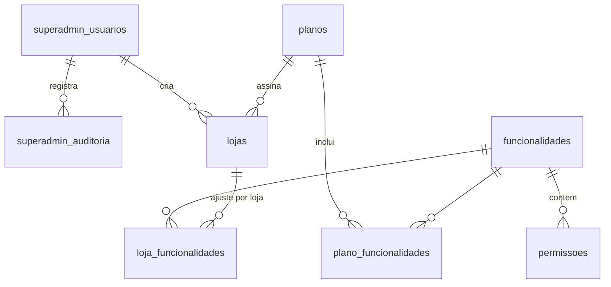
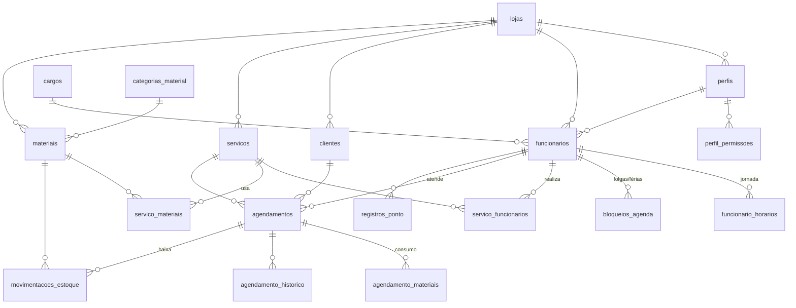

# Estrutura do Banco de Dados (PostgreSQL)

Planejamento do banco de dados para quando o back-end for criado. Este documento descreve **tabelas, colunas e relações**, além de algumas **regras de produto** anotadas ao longo do texto (marcadas com 📌).

O sistema é dividido em duas áreas:

1. **Plataforma (SUPERADMIN)**: gestão geral. Cria lojas, define planos, libera funcionalidades e controla acessos. Tem sua **própria tabela de usuários**.
2. **Painel da Loja**: tudo o que uma clínica usa no dia a dia (agenda, clientes, funcionários, serviços, materiais, ponto). **Toda tabela tem `loja_id`** e os dados de uma loja nunca se misturam com os de outra.

---

## Convenções

| Item | Padrão |
|---|---|
| Nomes | `snake_case`, tabelas no plural, em português |
| Chave primária | `id uuid DEFAULT gen_random_uuid()` |
| Datas/horas | `timestamptz` (sempre em UTC; exibição convertida pelo fuso da loja) |
| Datas sem hora | `date` |
| Valores monetários | `numeric(10,2)` |
| Auditoria básica | `criado_em timestamptz DEFAULT now()`, `atualizado_em timestamptz` |
| Exclusão | Preferir **exclusão lógica** (`ativo = false` ou `excluido_em`) em cadastros que têm histórico (clientes, funcionários, serviços, materiais) |
| Multi-loja | Toda tabela do Painel da Loja tem `loja_id uuid NOT NULL REFERENCES lojas(id)` |

📌 **Isolamento entre lojas:** além do `loja_id` em todas as tabelas, as chaves estrangeiras internas da loja são **compostas** (`loja_id`, `id`). Assim o banco impede, por exemplo, que um agendamento da Loja A aponte para um cliente da Loja B. Para isso, cada tabela da loja tem `UNIQUE (loja_id, id)`.

```sql
-- exemplo
ALTER TABLE clientes ADD CONSTRAINT clientes_loja_id_uk UNIQUE (loja_id, id);

ALTER TABLE agendamentos
  ADD CONSTRAINT agendamentos_cliente_fk
  FOREIGN KEY (loja_id, cliente_id) REFERENCES clientes (loja_id, id);
```

📌 **Opcional (recomendado):** ativar **Row Level Security (RLS)** do Postgres nas tabelas da loja, filtrando por `loja_id = current_setting('app.loja_id')::uuid`. É uma segunda camada de proteção caso alguma consulta esqueça o filtro.

---

# 1. Plataforma (SUPERADMIN)

Área administrativa global, fora do contexto de qualquer loja. Ainda não existe no front-end.

## Diagrama



## 1.1 `superadmin_usuarios`

Usuários que administram a plataforma. **Tabela separada** dos funcionários das lojas: um superadmin não é um funcionário e vice-versa.

| Coluna | Tipo | Regras |
|---|---|---|
| id | uuid | PK |
| nome | varchar(150) | NOT NULL |
| email | varchar(150) | NOT NULL, UNIQUE |
| senha_hash | varchar(255) | NOT NULL (bcrypt/argon2) |
| ativo | boolean | DEFAULT true |
| ultimo_login_em | timestamptz | |
| criado_em / atualizado_em | timestamptz | |

## 1.2 `planos`

Pacotes comerciais oferecidos às lojas.

| Coluna | Tipo | Regras |
|---|---|---|
| id | uuid | PK |
| nome | varchar(80) | NOT NULL, UNIQUE (ex.: Básico, Profissional) |
| descricao | text | |
| preco_mensal | numeric(10,2) | NOT NULL |
| limite_funcionarios | integer | NULL = ilimitado |
| limite_agendamentos_mes | integer | NULL = ilimitado |
| ativo | boolean | DEFAULT true |
| criado_em / atualizado_em | timestamptz | |

📌 Os limites são verificados pelo back-end ao criar funcionários ou agendamentos.

## 1.3 `funcionalidades`

Catálogo dos **módulos** do sistema. Cada item do menu da loja corresponde a uma funcionalidade.

| Coluna | Tipo | Regras |
|---|---|---|
| id | uuid | PK |
| codigo | varchar(50) | NOT NULL, UNIQUE |
| nome | varchar(100) | NOT NULL |
| descricao | text | |
| ativo | boolean | DEFAULT true |

Valores iniciais (mesmos menus do front-end):

| codigo | Menu |
|---|---|
| `inicio` | Início |
| `agenda` | Agenda e Agendamentos |
| `clientes` | Clientes |
| `funcionarios` | Funcionários |
| `servicos` | Serviços |
| `materiais` | Materiais |
| `controle_tempo` | Controle de Tempo |

## 1.4 `plano_funcionalidades`

Quais funcionalidades cada plano inclui.

| Coluna | Tipo | Regras |
|---|---|---|
| plano_id | uuid | PK, FK → planos |
| funcionalidade_id | uuid | PK, FK → funcionalidades |

## 1.5 `lojas`

Cada clínica cliente da plataforma. É o "tenant" de todo o Painel da Loja.

| Coluna | Tipo | Regras |
|---|---|---|
| id | uuid | PK |
| nome | varchar(150) | NOT NULL (razão social) |
| nome_fantasia | varchar(150) | |
| cnpj | varchar(18) | UNIQUE |
| slug | varchar(60) | NOT NULL, UNIQUE. Identifica a loja na URL/login (ex.: `clinica-sorriso`) |
| email | varchar(150) | |
| telefone | varchar(20) | |
| cep | varchar(9) | |
| logradouro | varchar(150) | |
| numero | varchar(10) | |
| complemento | varchar(80) | |
| bairro | varchar(80) | |
| cidade | varchar(80) | |
| uf | char(2) | |
| fuso_horario | varchar(50) | DEFAULT `'America/Sao_Paulo'` |
| plano_id | uuid | FK → planos |
| status | enum `status_loja` | `ativa`, `suspensa`, `cancelada`. DEFAULT `ativa` |
| criado_por | uuid | FK → superadmin_usuarios |
| criado_em / atualizado_em | timestamptz | |

📌 Loja `suspensa`: funcionários não conseguem fazer login, mas os dados são mantidos. Loja `cancelada`: dados mantidos por período definido antes da remoção.

📌 Ao criar uma loja, o sistema cria automaticamente: os **perfis padrão** (ver 2.1) e o **primeiro funcionário** com perfil Administrador.

## 1.6 `loja_funcionalidades`

Ajuste fino por loja, por cima do plano. Permite liberar ou bloquear um módulo para uma loja específica.

| Coluna | Tipo | Regras |
|---|---|---|
| loja_id | uuid | PK, FK → lojas |
| funcionalidade_id | uuid | PK, FK → funcionalidades |
| habilitado | boolean | NOT NULL |
| observacao | text | ex.: "liberado como cortesia até dez/2026" |
| expira_em | timestamptz | NULL = sem prazo |

📌 **Funcionalidade ativa na loja** = está no plano da loja **OU** `loja_funcionalidades.habilitado = true`, **E NÃO** existe registro com `habilitado = false`. O registro da loja sempre prevalece sobre o plano.

## 1.7 `permissoes`

Catálogo global de **ações** do sistema, mantido pelo superadmin. As lojas usam este catálogo para montar seus perfis (2.2).

| Coluna | Tipo | Regras |
|---|---|---|
| id | uuid | PK |
| funcionalidade_id | uuid | FK → funcionalidades |
| codigo | varchar(80) | NOT NULL, UNIQUE |
| descricao | varchar(200) | |

Exemplos de códigos:

| Funcionalidade | Permissões |
|---|---|
| agenda | `agenda.ver_propria`, `agenda.ver_todas`, `agendamentos.criar`, `agendamentos.editar`, `agendamentos.cancelar` |
| clientes | `clientes.ver`, `clientes.editar`, `clientes.excluir` |
| funcionarios | `funcionarios.ver`, `funcionarios.editar` |
| servicos | `servicos.ver`, `servicos.editar` |
| materiais | `materiais.ver`, `materiais.editar`, `estoque.movimentar` |
| controle_tempo | `ponto.registrar_proprio`, `ponto.ver_todos`, `ponto.editar` |

📌 Uma permissão só tem efeito se a funcionalidade dela estiver ativa na loja.

## 1.8 `superadmin_auditoria`

Registro de tudo o que o superadmin faz.

| Coluna | Tipo | Regras |
|---|---|---|
| id | bigserial | PK |
| superadmin_id | uuid | FK → superadmin_usuarios |
| loja_id | uuid | FK → lojas, NULL se a ação não for sobre uma loja |
| acao | varchar(80) | ex.: `loja.criar`, `loja.suspender`, `funcionalidade.liberar` |
| dados | jsonb | antes/depois da alteração |
| ip | inet | |
| criado_em | timestamptz | |

📌 Se no futuro o superadmin puder "entrar como" uma loja para dar suporte, isso também deve ser registrado aqui.

---

# 2. Painel da Loja

Todas as tabelas abaixo têm `loja_id`. Cobrem tudo o que o front-end atual usa.

## Diagrama



## 2.1 `perfis`

Perfis de acesso dos funcionários dentro da loja.

| Coluna | Tipo | Regras |
|---|---|---|
| id | uuid | PK |
| loja_id | uuid | FK → lojas |
| nome | varchar(60) | NOT NULL, UNIQUE (loja_id, nome) |
| descricao | text | |
| padrao | boolean | DEFAULT false. Perfis criados automaticamente não podem ser excluídos |
| criado_em / atualizado_em | timestamptz | |

Perfis padrão criados com a loja:

| Perfil | Acesso |
|---|---|
| **Administrador** | Tudo o que estiver habilitado na loja |
| **Recepção** | Agenda de todos os profissionais, clientes, registrar o próprio ponto |
| **Profissional** | Apenas a **própria agenda**, consulta de clientes, registrar o próprio ponto |

## 2.2 `perfil_permissoes`

| Coluna | Tipo | Regras |
|---|---|---|
| loja_id | uuid | |
| perfil_id | uuid | PK, FK (loja_id, perfil_id) → perfis |
| permissao_id | uuid | PK, FK → permissoes (catálogo global) |

## 2.3 `cargos`

Cargos/especialidades da loja (no front-end: Dentista, Fisioterapeuta, Recepcionista...). **Cargo é informativo**; quem define o acesso é o **perfil**.

| Coluna | Tipo | Regras |
|---|---|---|
| id | uuid | PK |
| loja_id | uuid | FK → lojas |
| nome | varchar(80) | NOT NULL, UNIQUE (loja_id, nome) |
| ativo | boolean | DEFAULT true |

## 2.4 `funcionarios`

Funcionários da loja. **São também os usuários que fazem login no Painel da Loja.**

| Coluna | Tipo | Regras |
|---|---|---|
| id | uuid | PK |
| loja_id | uuid | FK → lojas |
| perfil_id | uuid | NOT NULL, FK (loja_id, perfil_id) → perfis |
| cargo_id | uuid | FK (loja_id, cargo_id) → cargos |
| nome | varchar(150) | NOT NULL |
| cpf | varchar(14) | UNIQUE (loja_id, cpf) |
| email | varchar(150) | NOT NULL, UNIQUE (loja_id, email). Usado no login |
| senha_hash | varchar(255) | NOT NULL |
| telefone | varchar(20) | |
| cor_agenda | varchar(7) | cor do profissional no calendário (ex.: `#0f766e`) |
| ativo | boolean | DEFAULT true |
| ultimo_login_em | timestamptz | |
| criado_em / atualizado_em | timestamptz | |

📌 **Login:** como o e-mail é único **por loja**, o login precisa identificar a loja (pelo `slug` na URL ou num campo do formulário).

📌 Funcionário **inativo** não faz login, não aparece para novos agendamentos e não registra ponto, mas o histórico dele é mantido.

📌 Não é possível desativar o **último administrador** ativo da loja.

## 2.5 `funcionario_horarios`

Jornada semanal do funcionário. Define em que horários ele pode ser agendado.

| Coluna | Tipo | Regras |
|---|---|---|
| id | uuid | PK |
| loja_id | uuid | |
| funcionario_id | uuid | FK (loja_id, funcionario_id) → funcionarios |
| dia_semana | smallint | 0 = domingo ... 6 = sábado |
| hora_inicio | time | NOT NULL |
| hora_fim | time | NOT NULL, CHECK (hora_fim > hora_inicio) |

📌 Pode haver mais de uma faixa no mesmo dia (ex.: 08:00–12:00 e 13:00–18:00, com intervalo de almoço).

## 2.6 `bloqueios_agenda`

Períodos em que o profissional **não** pode ser agendado (férias, folga, compromisso).

| Coluna | Tipo | Regras |
|---|---|---|
| id | uuid | PK |
| loja_id | uuid | |
| funcionario_id | uuid | FK → funcionarios. NULL = bloqueio da loja inteira (ex.: feriado) |
| inicio | timestamptz | NOT NULL |
| fim | timestamptz | NOT NULL, CHECK (fim > inicio) |
| motivo | varchar(150) | |
| criado_por | uuid | FK → funcionarios |
| criado_em | timestamptz | |

## 2.7 `clientes`

| Coluna | Tipo | Regras |
|---|---|---|
| id | uuid | PK |
| loja_id | uuid | FK → lojas |
| nome | varchar(150) | NOT NULL |
| cpf | varchar(14) | UNIQUE (loja_id, cpf) quando preenchido |
| telefone | varchar(20) | NOT NULL |
| email | varchar(150) | |
| data_nascimento | date | |
| observacoes | text | alergias, preferências etc. |
| ativo | boolean | DEFAULT true |
| criado_em / atualizado_em | timestamptz | |

📌 O mesmo cliente (mesma pessoa) em duas lojas diferentes gera **dois registros independentes**. Uma loja não vê os clientes da outra.

📌 Cliente com agendamentos não é excluído fisicamente, apenas inativado.

## 2.8 `servicos`

| Coluna | Tipo | Regras |
|---|---|---|
| id | uuid | PK |
| loja_id | uuid | FK → lojas |
| nome | varchar(120) | NOT NULL, UNIQUE (loja_id, nome) |
| descricao | text | |
| duracao_minutos | integer | NOT NULL, CHECK (> 0) |
| preco | numeric(10,2) | |
| ativo | boolean | DEFAULT true |
| criado_em / atualizado_em | timestamptz | |

## 2.9 `servico_funcionarios`

Quais profissionais podem realizar cada serviço.

| Coluna | Tipo | Regras |
|---|---|---|
| loja_id | uuid | |
| servico_id | uuid | PK, FK (loja_id, servico_id) → servicos |
| funcionario_id | uuid | PK, FK (loja_id, funcionario_id) → funcionarios |

📌 Todo serviço ativo precisa ter **pelo menos um** profissional vinculado (validado no back-end).

📌 Um agendamento só pode ser criado se o par (serviço, profissional) existir nesta tabela.

## 2.10 `categorias_material`

| Coluna | Tipo | Regras |
|---|---|---|
| id | uuid | PK |
| loja_id | uuid | FK → lojas |
| nome | varchar(80) | NOT NULL, UNIQUE (loja_id, nome) |

## 2.11 `materiais`

| Coluna | Tipo | Regras |
|---|---|---|
| id | uuid | PK |
| loja_id | uuid | FK → lojas |
| categoria_id | uuid | FK (loja_id, categoria_id) → categorias_material |
| nome | varchar(150) | NOT NULL, UNIQUE (loja_id, nome) |
| unidade | varchar(10) | NOT NULL (un, cx, pct, ml...) |
| quantidade_atual | numeric(10,2) | NOT NULL DEFAULT 0 |
| estoque_minimo | numeric(10,2) | DEFAULT 0 |
| ativo | boolean | DEFAULT true |
| criado_em / atualizado_em | timestamptz | |

📌 `quantidade_atual` **nunca é alterada diretamente**: só muda através de um registro em `movimentacoes_estoque` (na mesma transação). Assim, todo o histórico do estoque fica rastreável.

📌 Material com `quantidade_atual < estoque_minimo` aparece como **"Repor"** (tela de Materiais e tela Início).

## 2.12 `servico_materiais`

Materiais consumidos por **um** atendimento do serviço.

| Coluna | Tipo | Regras |
|---|---|---|
| loja_id | uuid | |
| servico_id | uuid | PK, FK (loja_id, servico_id) → servicos |
| material_id | uuid | PK, FK (loja_id, material_id) → materiais |
| quantidade | numeric(10,2) | NOT NULL, CHECK (> 0) |

## 2.13 `agendamentos`

| Coluna | Tipo | Regras |
|---|---|---|
| id | uuid | PK |
| loja_id | uuid | FK → lojas |
| cliente_id | uuid | NOT NULL, FK (loja_id, cliente_id) → clientes |
| servico_id | uuid | NOT NULL, FK (loja_id, servico_id) → servicos |
| funcionario_id | uuid | NOT NULL, FK (loja_id, funcionario_id) → funcionarios |
| inicio | timestamptz | NOT NULL |
| fim | timestamptz | NOT NULL, CHECK (fim > inicio) |
| preco | numeric(10,2) | cópia do preço do serviço no momento do agendamento |
| status | enum `status_agendamento` | `agendado`, `confirmado`, `concluido`, `cancelado`, `nao_compareceu` |
| observacoes | text | |
| motivo_cancelamento | text | obrigatório quando `status = cancelado` |
| criado_por | uuid | FK → funcionarios |
| criado_em / atualizado_em | timestamptz | |

📌 **Duração:** `fim` é calculado como `inicio + servicos.duracao_minutos`, mas pode ser ajustado manualmente (o front-end permite alterar a duração).

📌 **Preço congelado:** se o preço do serviço mudar depois, o agendamento mantém o valor combinado.

📌 **Sem conflito de horário:** um profissional não pode ter dois agendamentos ativos sobrepostos. O próprio Postgres garante isso:

```sql
CREATE EXTENSION IF NOT EXISTS btree_gist;

ALTER TABLE agendamentos ADD CONSTRAINT agendamentos_sem_conflito
  EXCLUDE USING gist (
    funcionario_id WITH =,
    tstzrange(inicio, fim) WITH &&
  )
  WHERE (status NOT IN ('cancelado', 'nao_compareceu'));
```

📌 **Disponibilidade:** o back-end só aceita agendamentos dentro da jornada do profissional (`funcionario_horarios`) e fora dos `bloqueios_agenda`.

📌 **Visibilidade:** funcionário com `agenda.ver_propria` (perfil Profissional) só vê agendamentos onde `funcionario_id` é ele mesmo. Com `agenda.ver_todas` (Recepção, Administrador), vê todos.

📌 **Fluxo de status:**

```
agendado ──► confirmado ──► concluido
   │              │
   └──────────────┴──► cancelado / nao_compareceu
```

- `concluido`, `cancelado` e `nao_compareceu` são finais (só o Administrador pode reabrir).
- Ao ir para `concluido`: dá baixa nos materiais (ver 2.14 e 2.15).

Índices sugeridos:

```sql
CREATE INDEX ON agendamentos (loja_id, inicio);
CREATE INDEX ON agendamentos (loja_id, funcionario_id, inicio);
CREATE INDEX ON agendamentos (loja_id, cliente_id);
```

## 2.14 `agendamento_materiais`

Materiais **efetivamente usados** no atendimento. Ao criar o agendamento, é preenchida com uma cópia de `servico_materiais`; o profissional pode ajustar antes de concluir (usou mais ou menos).

| Coluna | Tipo | Regras |
|---|---|---|
| loja_id | uuid | |
| agendamento_id | uuid | PK, FK (loja_id, agendamento_id) → agendamentos |
| material_id | uuid | PK, FK (loja_id, material_id) → materiais |
| quantidade | numeric(10,2) | NOT NULL, CHECK (> 0) |

📌 Alterar os materiais do serviço depois **não afeta** agendamentos já criados.

## 2.15 `movimentacoes_estoque`

Histórico de toda entrada e saída de material.

| Coluna | Tipo | Regras |
|---|---|---|
| id | uuid | PK |
| loja_id | uuid | FK → lojas |
| material_id | uuid | NOT NULL, FK (loja_id, material_id) → materiais |
| tipo | enum `tipo_movimentacao` | `entrada`, `saida_atendimento`, `ajuste`, `perda` |
| quantidade | numeric(10,2) | NOT NULL. Positiva para entrada, negativa para saída |
| agendamento_id | uuid | FK → agendamentos. Preenchido quando `tipo = saida_atendimento` |
| funcionario_id | uuid | FK → funcionarios (quem registrou) |
| motivo | varchar(200) | obrigatório para `ajuste` e `perda` |
| criado_em | timestamptz | |

📌 **Baixa automática:** quando um agendamento muda para `concluido`, para cada linha de `agendamento_materiais` é criada uma movimentação `saida_atendimento` e `materiais.quantidade_atual` é atualizada, tudo na mesma transação.

📌 Se um agendamento concluído for reaberto, é gerada uma movimentação de estorno (o histórico nunca é apagado).

📌 Estoque **pode ficar negativo** (o atendimento não é bloqueado por falta de cadastro de entrada), mas gera alerta. *Decisão a confirmar.*

## 2.16 `registros_ponto`

Controle de tempo (entrada e saída) dos funcionários.

| Coluna | Tipo | Regras |
|---|---|---|
| id | uuid | PK |
| loja_id | uuid | FK → lojas |
| funcionario_id | uuid | NOT NULL, FK (loja_id, funcionario_id) → funcionarios |
| entrada | timestamptz | NOT NULL |
| saida | timestamptz | CHECK (saida > entrada). NULL = funcionário em serviço |
| origem | enum `origem_ponto` | `sistema`, `manual` |
| editado_por | uuid | FK → funcionarios. Preenchido em ajustes manuais |
| justificativa | text | obrigatória quando `origem = manual` |
| criado_em / atualizado_em | timestamptz | |

📌 Só pode existir **um registro em aberto** (sem saída) por funcionário:

```sql
CREATE UNIQUE INDEX registros_ponto_um_aberto
  ON registros_ponto (funcionario_id) WHERE saida IS NULL;
```

📌 Horário de entrada/saída vem do **servidor**, não do navegador. Correções só por quem tem `ponto.editar`, com justificativa.

📌 Horas trabalhadas = `saida - entrada` (calculado na consulta, não armazenado). A data exibida usa o fuso da loja.

## 2.17 `agendamento_historico`

Histórico de alterações de cada agendamento (quem remarcou, cancelou, mudou status).

| Coluna | Tipo | Regras |
|---|---|---|
| id | bigserial | PK |
| loja_id | uuid | |
| agendamento_id | uuid | FK (loja_id, agendamento_id) → agendamentos |
| funcionario_id | uuid | FK → funcionarios (quem alterou) |
| acao | varchar(40) | `criado`, `remarcado`, `status_alterado`, `profissional_alterado` |
| dados | jsonb | valores antes/depois |
| criado_em | timestamptz | |

---

# 3. Enums

```sql
CREATE TYPE status_loja        AS ENUM ('ativa', 'suspensa', 'cancelada');
CREATE TYPE status_agendamento AS ENUM ('agendado', 'confirmado', 'concluido', 'cancelado', 'nao_compareceu');
CREATE TYPE tipo_movimentacao  AS ENUM ('entrada', 'saida_atendimento', 'ajuste', 'perda');
CREATE TYPE origem_ponto       AS ENUM ('sistema', 'manual');
```

> `nao_compareceu` ainda não existe no front-end; precisa ser adicionado em `statusAgendamento` (`frontend/src/data/mock.js`).

---

# 4. Relação com o front-end atual

| Tela | Tabelas |
|---|---|
| Início | `agendamentos`, `clientes`, `registros_ponto`, `materiais` |
| Agenda | `agendamentos`, `funcionarios`, `funcionario_horarios`, `bloqueios_agenda` |
| Agendamentos | `agendamentos`, `clientes`, `servicos`, `servico_funcionarios`, `agendamento_materiais` |
| Clientes | `clientes` |
| Funcionários | `funcionarios`, `cargos`, `perfis` |
| Serviços | `servicos`, `servico_funcionarios`, `servico_materiais` |
| Materiais | `materiais`, `categorias_material`, `movimentacoes_estoque` |
| Controle de Tempo | `registros_ponto` |
| *(futuro)* Login da loja | `lojas` (slug), `funcionarios`, `perfis`, `perfil_permissoes`, `loja_funcionalidades` |
| *(futuro)* Painel SUPERADMIN | todas as tabelas da seção 1 |

Diferenças entre o mock atual e o banco:

| Front-end (mock) | Banco |
|---|---|
| `id` numérico | `uuid` |
| `data` + `hora` separados | `inicio` / `fim` (`timestamptz`) |
| `duracao` no agendamento | derivada de `fim - inicio` |
| `cargo` como texto | `cargo_id` → `cargos` |
| `categoria` como texto | `categoria_id` → `categorias_material` |
| `minimo` | `estoque_minimo` |
| `servico.funcionarioIds` (array) | tabela `servico_funcionarios` |
| `servico.materiais` (array) | tabela `servico_materiais` |
| ponto com `data` + `entrada`/`saida` em texto | `entrada` / `saida` (`timestamptz`) |
| Sem perfis/permissões | `perfis`, `perfil_permissoes`, `permissoes` |

---

# 5. Pontos em aberto

- [ ] Estoque pode ficar negativo ou deve bloquear a conclusão do atendimento?
- [ ] Cliente precisa de acesso próprio (agendar online)? Se sim, entra uma tabela de login de clientes.
- [ ] Antecedência mínima para agendar e para cancelar.
- [ ] Notificações (WhatsApp/e-mail) de confirmação e lembrete: exigiria tabela de fila/histórico de envios.
- [ ] Financeiro (pagamentos dos atendimentos, comissão de profissionais).
- [ ] Prontuário/anotações clínicas do atendimento (dados sensíveis, LGPD).
- [ ] Um mesmo funcionário trabalhando em mais de uma loja (hoje seria um cadastro por loja).
