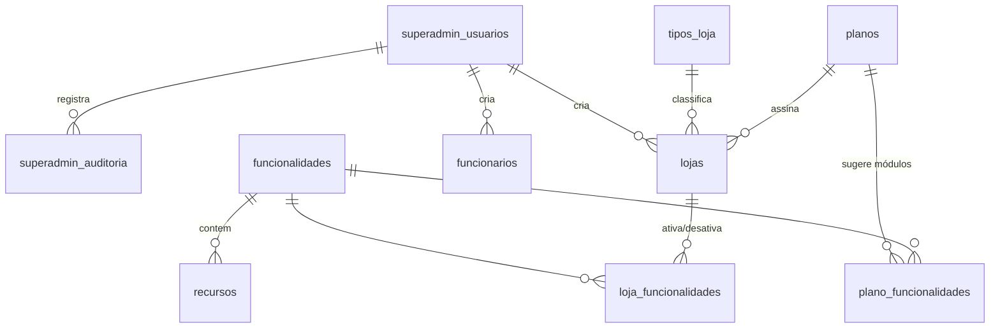
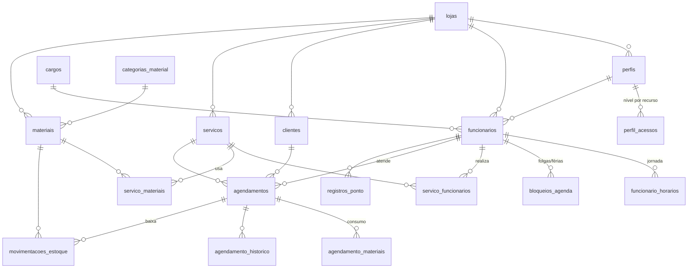

# Estrutura do Banco de Dados (PostgreSQL)

Planejamento do banco de dados para quando o back-end for criado. Este documento descreve **tabelas, colunas e relações**, além de algumas **regras de produto** anotadas ao longo do texto (marcadas com 📌).

O sistema é dividido em duas áreas:

1. **Plataforma (SUPERADMIN)**: gestão geral. Cria e edita lojas (incluindo o **tipo**), ativa/desativa módulos de cada loja individualmente, cria funcionários das lojas e mantém os catálogos globais. Tem sua **própria tabela de usuários**.
2. **Painel da Loja**: tudo o que uma loja (clínica, barbearia, escola...) usa no dia a dia (agenda, clientes, funcionários, serviços, materiais, ponto). **Toda tabela tem `loja_id`** e os dados de uma loja nunca se misturam com os de outra.

---

## Convenções

| Item | Padrão |
|---|---|
| Nomes | `snake_case`, tabelas no plural, em português |
| Chave primária | `id uuid DEFAULT gen_random_uuid()` |
| Datas/horas | `timestamptz` (sempre em UTC; exibição convertida pelo fuso da loja) |
| Datas sem hora | `date` |
| Valores monetários | `numeric(10,2)` |
| Colunas de controle | **Todas as tabelas** têm `criado_em` e `atualizado_em`. As tabelas da loja têm também `atualizado_por` (ver abaixo) |
| Exclusão | Preferir **exclusão lógica** (`ativo = false` ou `excluido_em`) em cadastros que têm histórico (clientes, funcionários, serviços, materiais) |
| Multi-loja | Toda tabela do Painel da Loja tem `loja_id uuid NOT NULL REFERENCES lojas(id)` |

📌 **Isolamento entre lojas:** além do `loja_id` em todas as tabelas, as chaves estrangeiras internas da loja são **compostas** (`loja_id`, `id`). Assim o banco impede, por exemplo, que um agendamento da Loja A aponte para um cliente da Loja B. Para isso, cada tabela da loja tem `UNIQUE (loja_id, id)`.

```sql
-- exemplo
ALTER TABLE clientes ADD CONSTRAINT clientes_loja_id_uk UNIQUE (loja_id, id);

ALTER TABLE agendamentos
  ADD CONSTRAINT agendamentos_cliente_fk
  FOREIGN KEY (loja_id, cliente_id) REFERENCES clientes (loja_id, id);
```

📌 **Opcional (recomendado):** ativar **Row Level Security (RLS)** do Postgres nas tabelas da loja, filtrando por `loja_id = current_setting('app.loja_id')::uuid`. É uma segunda camada de proteção caso alguma consulta esqueça o filtro.

## Colunas de controle (todas as tabelas)

| Coluna | Tipo | Onde | Regra |
|---|---|---|---|
| `criado_em` | timestamptz | Todas as tabelas | `NOT NULL DEFAULT now()`. Nunca muda |
| `atualizado_em` | timestamptz | Todas as tabelas | `NOT NULL DEFAULT now()`. Atualizado por trigger em todo `UPDATE` |
| `atualizado_por` | uuid | Todas as tabelas do **Painel da Loja** (seção 2) | FK (`loja_id`, `atualizado_por`) → `funcionarios`. Funcionário que fez a **última** alteração na linha (no `INSERT`, é quem criou) |

📌 `atualizado_por` é preenchido pelo próprio banco, a partir do funcionário logado que o back-end informa no início de cada transação. Assim nenhuma rota esquece de gravar:

```sql
-- back-end, no início de cada requisição da loja
SET LOCAL app.funcionario_id = '<id do funcionário logado>';

-- todas as tabelas
CREATE FUNCTION registrar_alteracao() RETURNS trigger AS $$
BEGIN
  NEW.atualizado_em := now();
  RETURN NEW;
END $$ LANGUAGE plpgsql;

-- tabelas da loja
CREATE FUNCTION registrar_alteracao_loja() RETURNS trigger AS $$
BEGIN
  NEW.atualizado_em  := now();
  NEW.atualizado_por := nullif(current_setting('app.funcionario_id', true), '')::uuid;
  RETURN NEW;
END $$ LANGUAGE plpgsql;

-- exemplo
CREATE TRIGGER agendamentos_alteracao BEFORE INSERT OR UPDATE ON agendamentos
  FOR EACH ROW EXECUTE FUNCTION registrar_alteracao_loja();
```

📌 Quando a alteração numa tabela da loja é feita pelo **superadmin** (ex.: criar um funcionário) ou por uma rotina automática, `atualizado_por` fica **NULL**. A ação do superadmin fica registrada em `superadmin_auditoria`.

📌 Nas tabelas da plataforma (seção 1) não existe `atualizado_por` para funcionário. Quem altera é o superadmin, e isso vai para `superadmin_auditoria`. `lojas` e `loja_funcionalidades` também guardam o último superadmin que alterou.

📌 Tabelas que só recebem inserções (`superadmin_auditoria`, `movimentacoes_estoque`, `agendamento_historico`) também têm as colunas, por padrão. Como as linhas nunca são alteradas, `atualizado_em` é igual a `criado_em`.

📌 `atualizado_por` guarda apenas a **última** alteração. O histórico completo existe hoje só para agendamentos (`agendamento_historico`, 2.17).

---

# 1. Plataforma (SUPERADMIN)

Área administrativa global, fora do contexto de qualquer loja. Ainda não existe no front-end.

O que o superadmin faz:

| Ação | Onde fica |
|---|---|
| Criar e editar os **dados gerais da loja** (cadastro, endereço, **tipo**, plano, status) | `lojas` (1.6), `tipos_loja` (1.2) |
| Manter o cadastro de **tipos de loja** (Clínica, Barbearia, Escola...) | `tipos_loja` (1.2) |
| **Ativar ou desativar módulos** de cada loja, um a um (Serviços, Materiais, Controle de Tempo) | `loja_funcionalidades` (1.7) |
| **Criar e editar funcionários** (usuários) de qualquer loja | `funcionarios` (2.4) |
| Manter o catálogo de **recursos** usados nos níveis de acesso | `recursos` (1.8) |

Tudo isso fica registrado em `superadmin_auditoria` (1.9).

## Diagrama



## 1.1 `superadmin_usuarios`

Usuários que administram a plataforma. **Tabela separada** dos funcionários das lojas: um superadmin não é um funcionário e vice-versa.

| Coluna | Tipo | Regras |
|---|---|---|
| id | uuid | PK |
| nome | varchar(150) | NOT NULL |
| email | varchar(150) | NOT NULL, UNIQUE |
| senha_hash | varchar(255) | NOT NULL (bcrypt/argon2) |
| ativo | boolean | DEFAULT true |
| ultimo_login_em | timestamptz | |
| criado_em | timestamptz | NOT NULL DEFAULT now() |
| atualizado_em | timestamptz | NOT NULL DEFAULT now(). Atualizado automaticamente em todo UPDATE (trigger) |

## 1.2 `tipos_loja`

Tipo do negócio. Cadastro mantido pelo superadmin (criar, editar, inativar).

| Coluna | Tipo | Regras |
|---|---|---|
| id | uuid | PK |
| codigo | varchar(30) | NOT NULL, UNIQUE |
| nome | varchar(60) | NOT NULL |
| descricao | text | |
| ativo | boolean | DEFAULT true |
| criado_em | timestamptz | NOT NULL DEFAULT now() |
| atualizado_em | timestamptz | NOT NULL DEFAULT now(). Atualizado automaticamente em todo UPDATE (trigger) |

Valores iniciais:

| codigo | nome |
|---|---|
| `clinica` | Clínica |
| `barbearia` | Barbearia |
| `escola` | Escola |

📌 **O tipo NÃO muda nada no Painel da Loja.** Ele não libera nem bloqueia módulos (isso é feito em `loja_funcionalidades`, 1.7) e não altera telas internas.

📌 **Uso futuro:** o tipo será lido apenas por um **futuro front-end do consumidor final** (onde o cliente vê a loja e agenda), para adaptar textos e apresentação. Ex.: numa Escola (de música), "Profissional" vira "Professor" e "Serviço" vira "Aula"; numa Barbearia, "Profissional" vira "Barbeiro".

## 1.3 `planos`

Pacotes comerciais oferecidos às lojas.

| Coluna | Tipo | Regras |
|---|---|---|
| id | uuid | PK |
| nome | varchar(80) | NOT NULL, UNIQUE (ex.: Básico, Profissional) |
| descricao | text | |
| preco_mensal | numeric(10,2) | NOT NULL |
| limite_funcionarios | integer | NULL = ilimitado |
| limite_agendamentos_mes | integer | NULL = ilimitado |
| ativo | boolean | DEFAULT true |
| criado_em | timestamptz | NOT NULL DEFAULT now() |
| atualizado_em | timestamptz | NOT NULL DEFAULT now(). Atualizado automaticamente em todo UPDATE (trigger) |

📌 Os limites são verificados pelo back-end ao criar funcionários ou agendamentos.

## 1.4 `funcionalidades`

Catálogo dos **módulos** do sistema. Cada item do menu da loja corresponde a uma funcionalidade.

| Coluna | Tipo | Regras |
|---|---|---|
| id | uuid | PK |
| codigo | varchar(50) | NOT NULL, UNIQUE |
| nome | varchar(100) | NOT NULL |
| descricao | text | |
| opcional | boolean | NOT NULL. `true` = o superadmin pode ativar/desativar por loja. `false` = módulo base, sempre ativo |
| ativo | boolean | DEFAULT true |
| criado_em | timestamptz | NOT NULL DEFAULT now() |
| atualizado_em | timestamptz | NOT NULL DEFAULT now(). Atualizado automaticamente em todo UPDATE (trigger) |

Valores iniciais (mesmos menus do front-end):

| codigo | Menu | opcional |
|---|---|---|
| `inicio` | Início | não |
| `agenda` | Agenda e Agendamentos | não |
| `clientes` | Clientes | não |
| `funcionarios` | Funcionários | não |
| `configuracoes` | Configurações | não |
| `servicos` | Serviços | **sim** |
| `materiais` | Materiais | **sim** |
| `controle_tempo` | Controle de Tempo | **sim** |

📌 Por enquanto só **Serviços, Materiais e Controle de Tempo** podem ser desativados. Para tornar outro módulo opcional no futuro, basta mudar `opcional` para `true`.

## 1.5 `plano_funcionalidades`

Quais módulos opcionais cada plano sugere. **Serve apenas como modelo na criação da loja** (ver 1.7); não controla o acesso depois disso.

| Coluna | Tipo | Regras |
|---|---|---|
| plano_id | uuid | PK, FK → planos |
| funcionalidade_id | uuid | PK, FK → funcionalidades |
| criado_em | timestamptz | NOT NULL DEFAULT now() |
| atualizado_em | timestamptz | NOT NULL DEFAULT now(). Atualizado automaticamente em todo UPDATE (trigger) |

## 1.6 `lojas`

Cada negócio cliente da plataforma (clínica, barbearia, escola...). É o "tenant" de todo o Painel da Loja. **Criada pelo superadmin.** Parte dos dados também pode ser editada pela própria loja, no menu **Configurações** (ver 2.18).

| Coluna | Tipo | Regras |
|---|---|---|
| id | uuid | PK |
| tipo_loja_id | uuid | NOT NULL, FK → tipos_loja |
| nome | varchar(150) | NOT NULL (razão social) |
| nome_fantasia | varchar(150) | Nome exibido da loja |
| cnpj | varchar(18) | Opcional. UNIQUE quando preenchido |
| logo_url | varchar(500) | Caminho do arquivo da logo no storage. NULL = sem logo |
| slug | varchar(60) | NOT NULL, UNIQUE. Identifica a loja na URL/login (ex.: `clinica-sorriso`) |
| email | varchar(150) | |
| telefone | varchar(20) | |
| cep | varchar(9) | |
| logradouro | varchar(150) | |
| numero | varchar(10) | |
| complemento | varchar(80) | |
| bairro | varchar(80) | |
| cidade | varchar(80) | |
| uf | char(2) | |
| fuso_horario | varchar(50) | DEFAULT `'America/Sao_Paulo'` |
| plano_id | uuid | FK → planos |
| status | enum `status_loja` | `ativa`, `suspensa`, `cancelada`. DEFAULT `ativa` |
| criado_por | uuid | FK → superadmin_usuarios |
| atualizado_por_funcionario | uuid | FK → funcionarios. Última edição feita pela loja |
| atualizado_por_superadmin | uuid | FK → superadmin_usuarios. Última edição feita pelo superadmin |
| criado_em | timestamptz | NOT NULL DEFAULT now() |
| atualizado_em | timestamptz | NOT NULL DEFAULT now(). Atualizado automaticamente em todo UPDATE (trigger) |

📌 Loja `suspensa`: funcionários não conseguem fazer login, mas os dados são mantidos. Loja `cancelada`: dados mantidos por período definido antes da remoção.

📌 Ao criar uma loja, o sistema cria automaticamente: os **perfis padrão** (ver 2.1) e os registros de **`loja_funcionalidades`** (ver 1.7). No mesmo fluxo, o superadmin cadastra o **primeiro funcionário** com perfil Administrador.

## 1.7 `loja_funcionalidades`

**Liga e desliga cada módulo opcional da loja, individualmente.** É a única fonte que define o que a loja tem acesso (não depende do tipo nem do plano).

| Coluna | Tipo | Regras |
|---|---|---|
| loja_id | uuid | PK, FK → lojas |
| funcionalidade_id | uuid | PK, FK → funcionalidades (apenas as com `opcional = true`) |
| habilitado | boolean | NOT NULL |
| observacao | text | ex.: "liberado como cortesia até dez/2026" |
| expira_em | timestamptz | NULL = sem prazo. Ao vencer, o módulo é considerado desativado |
| atualizado_por | uuid | FK → superadmin_usuarios. Superadmin que fez a última alteração |
| criado_em | timestamptz | NOT NULL DEFAULT now() |
| atualizado_em | timestamptz | NOT NULL DEFAULT now(). Atualizado automaticamente em todo UPDATE (trigger) |

📌 **Módulo ativo na loja** = funcionalidade com `opcional = false` **OU** registro com `habilitado = true` (e `expira_em` nula ou futura).

📌 **Na criação da loja**, é gerado um registro para cada módulo opcional: habilitado se estiver no plano escolhido (`plano_funcionalidades`); sem plano, todos habilitados. Depois disso o superadmin liga/desliga à vontade, e trocar de plano **não** altera os módulos automaticamente.

📌 **Desativar um módulo não apaga dados.** O menu e as telas somem, a API recusa as chamadas daquele módulo, e ao reativar tudo volta como estava.

📌 Efeitos de cada módulo desativado:

| Módulo desativado | Efeito |
|---|---|
| Serviços | Agendamento é criado **sem serviço**: duração e preço informados manualmente (ver 2.13) |
| Materiais | Não há consumo de materiais nem baixa de estoque ao concluir atendimentos |
| Controle de Tempo | Funcionários não registram ponto |

## 1.8 `recursos`

Catálogo global das **áreas do sistema que podem ter nível de acesso** (nenhum, leitura ou escrita). Mantido pelo superadmin. As lojas usam este catálogo para montar seus perfis (2.2).

| Coluna | Tipo | Regras |
|---|---|---|
| id | uuid | PK |
| funcionalidade_id | uuid | NOT NULL, FK → funcionalidades |
| codigo | varchar(50) | NOT NULL, UNIQUE |
| nome | varchar(100) | NOT NULL (texto exibido na tela de perfis) |
| descricao | text | |
| ordem | smallint | ordem de exibição |
| criado_em | timestamptz | NOT NULL DEFAULT now() |
| atualizado_em | timestamptz | NOT NULL DEFAULT now(). Atualizado automaticamente em todo UPDATE (trigger) |

Valores iniciais:

| codigo | Nome | Módulo | **Leitura** permite | **Escrita** permite |
|---|---|---|---|---|
| `agenda_propria` | Minha agenda | agenda | Ver os próprios agendamentos | Criar, remarcar, mudar status e cancelar os próprios |
| `agenda_equipe` | Agenda da equipe | agenda | Ver agendamentos de todos | Criar, remarcar, mudar status e cancelar de qualquer profissional |
| `config_agendamentos` | Configurar agendamentos | agenda | Ver jornadas e bloqueios | Editar jornadas (2.5), bloqueios, folgas e feriados (2.6) |
| `clientes` | Clientes | clientes | Ver lista e ficha | Cadastrar, editar, inativar |
| `funcionarios` | Funcionários | funcionarios | Ver lista | Cadastrar, editar, inativar, definir cargo e perfil |
| `perfis_acesso` | Perfis de acesso | funcionarios | Ver perfis e seus níveis | Criar e editar perfis e níveis |
| `servicos` | Serviços | servicos | Ver serviços | Cadastrar, editar, vincular profissionais e materiais |
| `materiais` | Materiais | materiais | Ver estoque e movimentações | Cadastrar, editar, lançar entradas, ajustes e perdas |
| `ponto_proprio` | Meu ponto | controle_tempo | Ver os próprios registros | Registrar entrada e saída |
| `ponto_equipe` | Ponto da equipe | controle_tempo | Ver registros de todos | Corrigir registros (com justificativa) |
| `config_loja` | Dados da loja | configuracoes | Ver logo, nome, contato, endereço e CNPJ | Editar esses dados (ver 2.18) |

📌 Um recurso só tem efeito se o módulo dele estiver ativo na loja. Módulo desativado = nível `nenhum` para todos, inclusive o Administrador.

## 1.9 `superadmin_auditoria`

Registro de tudo o que o superadmin faz.

| Coluna | Tipo | Regras |
|---|---|---|
| id | bigserial | PK |
| superadmin_id | uuid | FK → superadmin_usuarios |
| loja_id | uuid | FK → lojas, NULL se a ação não for sobre uma loja |
| acao | varchar(80) | ex.: `loja.criar`, `loja.editar`, `loja.suspender`, `funcionalidade.ativar`, `funcionalidade.desativar`, `funcionario.criar`, `funcionario.editar`, `tipo_loja.editar` |
| dados | jsonb | antes/depois da alteração |
| ip | inet | |
| criado_em | timestamptz | NOT NULL DEFAULT now() |
| atualizado_em | timestamptz | NOT NULL DEFAULT now(). Atualizado automaticamente em todo UPDATE (trigger) |

📌 Se no futuro o superadmin puder "entrar como" uma loja para dar suporte, isso também deve ser registrado aqui.

---

# 2. Painel da Loja

Todas as tabelas abaixo têm `loja_id`. Cobrem tudo o que o front-end atual usa.

## Diagrama



## 2.1 `perfis`

Perfis de acesso dos funcionários dentro da loja. Cada perfil define, para cada recurso (1.8), um nível: **nenhum**, **leitura** ou **escrita** (2.2). Cada funcionário tem um perfil.

| Coluna | Tipo | Regras |
|---|---|---|
| id | uuid | PK |
| loja_id | uuid | FK → lojas |
| nome | varchar(60) | NOT NULL, UNIQUE (loja_id, nome) |
| descricao | text | |
| padrao | boolean | DEFAULT false. Perfis criados automaticamente não podem ser excluídos |
| acesso_total | boolean | DEFAULT false. `true` só no Administrador: escrita em tudo, não editável |
| criado_em | timestamptz | NOT NULL DEFAULT now() |
| atualizado_em | timestamptz | NOT NULL DEFAULT now(). Atualizado automaticamente em todo UPDATE (trigger) |
| atualizado_por | uuid | FK (loja_id, atualizado_por) → funcionarios. Funcionário que fez a última alteração na linha |

Perfis padrão criados com a loja (a loja pode editar Recepção e Profissional e criar outros):

| Recurso | Administrador | Recepção | Profissional |
|---|---|---|---|
| Minha agenda | escrita | escrita | escrita |
| Agenda da equipe | escrita | escrita | nenhum |
| Configurar agendamentos | escrita | leitura | nenhum |
| Clientes | escrita | escrita | leitura |
| Funcionários | escrita | nenhum | nenhum |
| Perfis de acesso | escrita | nenhum | nenhum |
| Serviços | escrita | leitura | nenhum |
| Materiais | escrita | nenhum | nenhum |
| Meu ponto | escrita | escrita | escrita |
| Ponto da equipe | escrita | nenhum | nenhum |
| Dados da loja | escrita | nenhum | nenhum |

## 2.2 `perfil_acessos`

Nível de acesso de cada perfil em cada recurso.

| Coluna | Tipo | Regras |
|---|---|---|
| loja_id | uuid | |
| perfil_id | uuid | PK, FK (loja_id, perfil_id) → perfis |
| recurso_id | uuid | PK, FK → recursos (catálogo global, 1.8) |
| nivel | enum `nivel_acesso` | NOT NULL. `nenhum`, `leitura`, `escrita` |
| criado_em | timestamptz | NOT NULL DEFAULT now() |
| atualizado_em | timestamptz | NOT NULL DEFAULT now(). Atualizado automaticamente em todo UPDATE (trigger) |
| atualizado_por | uuid | FK (loja_id, atualizado_por) → funcionarios. Funcionário que fez a última alteração na linha |

📌 **Níveis:**
- `nenhum`: o item não aparece no menu e a API responde 403.
- `leitura`: vê, mas não altera (botões de criar/editar/excluir ficam ocultos).
- `escrita`: vê e altera. **Escrita inclui leitura.**

📌 Recurso **sem linha** nesta tabela = `nenhum`. Assim, um recurso novo adicionado ao catálogo começa bloqueado para todos os perfis, exceto o Administrador.

📌 **Nível efetivo** = nível do perfil, **mas** `nenhum` se o módulo do recurso estiver desativado na loja (1.7).

📌 **Sem escalada de acesso:** quem tem escrita em *Funcionários* mas não em *Perfis de acesso* só pode atribuir perfis existentes, e nunca o perfil Administrador. Só o Administrador (ou o superadmin) atribui o perfil Administrador.

📌 Listas de apoio usadas em formulários (ex.: escolher serviço e profissional ao criar um agendamento) são liberadas para quem pode criar agendamentos, mesmo sem leitura em *Serviços* ou *Funcionários*. Só os dados necessários (id, nome) são retornados.

## 2.3 `cargos`

Cargos/especialidades da loja (no front-end: Dentista, Fisioterapeuta, Recepcionista...). **Cargo é informativo**; quem define o acesso é o **perfil**.

| Coluna | Tipo | Regras |
|---|---|---|
| id | uuid | PK |
| loja_id | uuid | FK → lojas |
| nome | varchar(80) | NOT NULL, UNIQUE (loja_id, nome) |
| ativo | boolean | DEFAULT true |
| criado_em | timestamptz | NOT NULL DEFAULT now() |
| atualizado_em | timestamptz | NOT NULL DEFAULT now(). Atualizado automaticamente em todo UPDATE (trigger) |
| atualizado_por | uuid | FK (loja_id, atualizado_por) → funcionarios. Funcionário que fez a última alteração na linha |

## 2.4 `funcionarios`

Funcionários da loja. **São também os usuários que fazem login no Painel da Loja.**

| Coluna | Tipo | Regras |
|---|---|---|
| id | uuid | PK |
| loja_id | uuid | FK → lojas |
| perfil_id | uuid | NOT NULL, FK (loja_id, perfil_id) → perfis |
| cargo_id | uuid | FK (loja_id, cargo_id) → cargos |
| nome | varchar(150) | NOT NULL |
| cpf | varchar(14) | UNIQUE (loja_id, cpf) |
| email | varchar(150) | NOT NULL, UNIQUE (loja_id, email). Usado no login |
| senha_hash | varchar(255) | NOT NULL |
| telefone | varchar(20) | |
| cor_agenda | varchar(7) | cor do profissional no calendário (ex.: `#0f766e`) |
| ativo | boolean | DEFAULT true |
| ultimo_login_em | timestamptz | |
| criado_por_funcionario | uuid | FK → funcionarios. Preenchido quando criado dentro da loja |
| criado_por_superadmin | uuid | FK → superadmin_usuarios. Preenchido quando criado pelo superadmin |
| criado_em | timestamptz | NOT NULL DEFAULT now() |
| atualizado_em | timestamptz | NOT NULL DEFAULT now(). Atualizado automaticamente em todo UPDATE (trigger) |
| atualizado_por | uuid | FK (loja_id, atualizado_por) → funcionarios. Funcionário que fez a última alteração na linha |

📌 **Quem cria funcionários:** o **superadmin** (para qualquer loja, a qualquer momento, com qualquer perfil, incluindo Administrador) e, dentro da loja, quem tem **escrita** em *Funcionários*. Exatamente uma das colunas `criado_por_*` é preenchida. Ações do superadmin vão para `superadmin_auditoria`.

📌 O superadmin também pode editar, inativar e redefinir a senha de qualquer funcionário.

📌 **Login:** como o e-mail é único **por loja**, o login precisa identificar a loja (pelo `slug` na URL ou num campo do formulário).

📌 Funcionário **inativo** não faz login, não aparece para novos agendamentos e não registra ponto, mas o histórico dele é mantido.

📌 Não é possível desativar o **último administrador** ativo da loja.

## 2.5 `funcionario_horarios`

Jornada semanal do funcionário. Define em que horários ele pode ser agendado.

| Coluna | Tipo | Regras |
|---|---|---|
| id | uuid | PK |
| loja_id | uuid | |
| funcionario_id | uuid | FK (loja_id, funcionario_id) → funcionarios |
| dia_semana | smallint | 0 = domingo ... 6 = sábado |
| hora_inicio | time | NOT NULL |
| hora_fim | time | NOT NULL, CHECK (hora_fim > hora_inicio) |
| criado_em | timestamptz | NOT NULL DEFAULT now() |
| atualizado_em | timestamptz | NOT NULL DEFAULT now(). Atualizado automaticamente em todo UPDATE (trigger) |
| atualizado_por | uuid | FK (loja_id, atualizado_por) → funcionarios. Funcionário que fez a última alteração na linha |

📌 Pode haver mais de uma faixa no mesmo dia (ex.: 08:00–12:00 e 13:00–18:00, com intervalo de almoço).

## 2.6 `bloqueios_agenda`

Períodos em que o profissional **não** pode ser agendado (férias, folga, compromisso).

| Coluna | Tipo | Regras |
|---|---|---|
| id | uuid | PK |
| loja_id | uuid | |
| funcionario_id | uuid | FK → funcionarios. NULL = bloqueio da loja inteira (ex.: feriado) |
| inicio | timestamptz | NOT NULL |
| fim | timestamptz | NOT NULL, CHECK (fim > inicio) |
| motivo | varchar(150) | |
| criado_por | uuid | FK → funcionarios |
| criado_em | timestamptz | NOT NULL DEFAULT now() |
| atualizado_em | timestamptz | NOT NULL DEFAULT now(). Atualizado automaticamente em todo UPDATE (trigger) |
| atualizado_por | uuid | FK (loja_id, atualizado_por) → funcionarios. Funcionário que fez a última alteração na linha |

📌 Jornadas (2.5) e bloqueios só são alterados por quem tem **escrita** em *Configurar agendamentos*.

## 2.7 `clientes`

| Coluna | Tipo | Regras |
|---|---|---|
| id | uuid | PK |
| loja_id | uuid | FK → lojas |
| nome | varchar(150) | NOT NULL |
| cpf | varchar(14) | UNIQUE (loja_id, cpf) quando preenchido |
| telefone | varchar(20) | NOT NULL |
| email | varchar(150) | |
| data_nascimento | date | |
| observacoes | text | alergias, preferências etc. |
| canais | `canal_cliente[]` | NOT NULL DEFAULT `'{}'`. Por onde o cliente fala com a loja; pode ter mais de um: `loja`, `whatsapp`, `site` |
| ativo | boolean | DEFAULT true |
| criado_em | timestamptz | NOT NULL DEFAULT now() |
| atualizado_em | timestamptz | NOT NULL DEFAULT now(). Atualizado automaticamente em todo UPDATE (trigger) |
| atualizado_por | uuid | FK (loja_id, atualizado_por) → funcionarios. Funcionário que fez a última alteração na linha |

📌 O mesmo cliente (mesma pessoa) em duas lojas diferentes gera **dois registros independentes**. Uma loja não vê os clientes da outra.

📌 Cliente com agendamentos não é excluído fisicamente, apenas inativado.

📌 **Canais:** quem se cadastra pelo site entra com `site`. Se o telefone já existir na loja, o cadastro é reaproveitado e ganha o canal `site`. No painel, cada canal aparece como um ícone (loja, WhatsApp, site).

## 2.8 `servicos`

| Coluna | Tipo | Regras |
|---|---|---|
| id | uuid | PK |
| loja_id | uuid | FK → lojas |
| nome | varchar(120) | NOT NULL, UNIQUE (loja_id, nome) |
| descricao | text | |
| duracao_minutos | integer | NOT NULL, CHECK (> 0) |
| preco | numeric(10,2) | |
| ativo | boolean | DEFAULT true |
| criado_em | timestamptz | NOT NULL DEFAULT now() |
| atualizado_em | timestamptz | NOT NULL DEFAULT now(). Atualizado automaticamente em todo UPDATE (trigger) |
| atualizado_por | uuid | FK (loja_id, atualizado_por) → funcionarios. Funcionário que fez a última alteração na linha |

## 2.9 `servico_funcionarios`

Quais profissionais podem realizar cada serviço.

| Coluna | Tipo | Regras |
|---|---|---|
| loja_id | uuid | |
| servico_id | uuid | PK, FK (loja_id, servico_id) → servicos |
| funcionario_id | uuid | PK, FK (loja_id, funcionario_id) → funcionarios |
| criado_em | timestamptz | NOT NULL DEFAULT now() |
| atualizado_em | timestamptz | NOT NULL DEFAULT now(). Atualizado automaticamente em todo UPDATE (trigger) |
| atualizado_por | uuid | FK (loja_id, atualizado_por) → funcionarios. Funcionário que fez a última alteração na linha |

📌 Todo serviço ativo precisa ter **pelo menos um** profissional vinculado (validado no back-end).

📌 Um agendamento só pode ser criado se o par (serviço, profissional) existir nesta tabela.

## 2.10 `categorias_material`

| Coluna | Tipo | Regras |
|---|---|---|
| id | uuid | PK |
| loja_id | uuid | FK → lojas |
| nome | varchar(80) | NOT NULL, UNIQUE (loja_id, nome) |
| criado_em | timestamptz | NOT NULL DEFAULT now() |
| atualizado_em | timestamptz | NOT NULL DEFAULT now(). Atualizado automaticamente em todo UPDATE (trigger) |
| atualizado_por | uuid | FK (loja_id, atualizado_por) → funcionarios. Funcionário que fez a última alteração na linha |

## 2.11 `materiais`

| Coluna | Tipo | Regras |
|---|---|---|
| id | uuid | PK |
| loja_id | uuid | FK → lojas |
| categoria_id | uuid | FK (loja_id, categoria_id) → categorias_material |
| nome | varchar(150) | NOT NULL, UNIQUE (loja_id, nome) |
| unidade | varchar(10) | NOT NULL (un, cx, pct, ml...) |
| quantidade_atual | numeric(10,2) | NOT NULL DEFAULT 0 |
| estoque_minimo | numeric(10,2) | DEFAULT 0 |
| ativo | boolean | DEFAULT true |
| criado_em | timestamptz | NOT NULL DEFAULT now() |
| atualizado_em | timestamptz | NOT NULL DEFAULT now(). Atualizado automaticamente em todo UPDATE (trigger) |
| atualizado_por | uuid | FK (loja_id, atualizado_por) → funcionarios. Funcionário que fez a última alteração na linha |

📌 `quantidade_atual` **nunca é alterada diretamente**: só muda através de um registro em `movimentacoes_estoque` (na mesma transação). Assim, todo o histórico do estoque fica rastreável.

📌 Material com `quantidade_atual < estoque_minimo` aparece como **"Repor"** (tela de Materiais e tela Início).

## 2.12 `servico_materiais`

Materiais consumidos por **um** atendimento do serviço.

| Coluna | Tipo | Regras |
|---|---|---|
| loja_id | uuid | |
| servico_id | uuid | PK, FK (loja_id, servico_id) → servicos |
| material_id | uuid | PK, FK (loja_id, material_id) → materiais |
| quantidade | numeric(10,2) | NOT NULL, CHECK (> 0) |
| criado_em | timestamptz | NOT NULL DEFAULT now() |
| atualizado_em | timestamptz | NOT NULL DEFAULT now(). Atualizado automaticamente em todo UPDATE (trigger) |
| atualizado_por | uuid | FK (loja_id, atualizado_por) → funcionarios. Funcionário que fez a última alteração na linha |

## 2.13 `agendamentos`

| Coluna | Tipo | Regras |
|---|---|---|
| id | uuid | PK |
| loja_id | uuid | FK → lojas |
| cliente_id | uuid | NOT NULL, FK (loja_id, cliente_id) → clientes |
| servico_id | uuid | FK (loja_id, servico_id) → servicos. Obrigatório quando o módulo Serviços está ativo (validado no back-end) |
| funcionario_id | uuid | NOT NULL, FK (loja_id, funcionario_id) → funcionarios |
| inicio | timestamptz | NOT NULL |
| fim | timestamptz | NOT NULL, CHECK (fim > inicio) |
| preco | numeric(10,2) | cópia do preço do serviço no momento do agendamento |
| status | enum `status_agendamento` | `pendente`, `agendado`, `confirmado`, `concluido`, `cancelado`, `nao_compareceu` |
| origem | enum `origem_agendamento` | `painel`, `site`. DEFAULT `painel` |
| observacoes | text | |
| motivo_cancelamento | text | obrigatório quando `status = cancelado` |
| criado_por | uuid | FK → funcionarios |
| criado_em | timestamptz | NOT NULL DEFAULT now() |
| atualizado_em | timestamptz | NOT NULL DEFAULT now(). Atualizado automaticamente em todo UPDATE (trigger) |
| atualizado_por | uuid | FK (loja_id, atualizado_por) → funcionarios. Funcionário que fez a última alteração na linha |

📌 **Duração:** `fim` é calculado como `inicio + servicos.duracao_minutos`, mas pode ser ajustado manualmente (o front-end permite alterar a duração). Com o módulo **Serviços desativado**, não há serviço: duração e preço são informados manualmente e a regra de `servico_funcionarios` não se aplica.

📌 **Preço congelado:** se o preço do serviço mudar depois, o agendamento mantém o valor combinado.

📌 **Sem conflito de horário:** um profissional não pode ter dois agendamentos ativos sobrepostos. O próprio Postgres garante isso:

```sql
CREATE EXTENSION IF NOT EXISTS btree_gist;

ALTER TABLE agendamentos ADD CONSTRAINT agendamentos_sem_conflito
  EXCLUDE USING gist (
    funcionario_id WITH =,
    tstzrange(inicio, fim) WITH &&
  )
  WHERE (status NOT IN ('cancelado', 'nao_compareceu'));
```

📌 **Disponibilidade:** o back-end só aceita agendamentos dentro da jornada do profissional (`funcionario_horarios`) e fora dos `bloqueios_agenda`.

📌 **Visibilidade:** funcionário com acesso apenas em *Minha agenda* (perfil Profissional) só vê agendamentos onde `funcionario_id` é ele mesmo. Com leitura em *Agenda da equipe* (Recepção, Administrador), vê todos. Em cada caso, **leitura** só vê e **escrita** pode criar, remarcar, mudar status e cancelar.

📌 **Fluxo de status:**

```
pendente (site) ──► confirmado (loja aceitou)
   └──────────────► cancelado (loja recusou)

agendado ──► confirmado ──► concluido
   │              │
   └──────────────┴──► cancelado / nao_compareceu
```

- Pedidos feitos pelo **site do consumidor** entram como `pendente` e já **ocupam o horário** (não aparecem como livres para outro cliente). Quem tem escrita na agenda aceita (`confirmado`) ou recusa (`cancelado`, com motivo).
- `concluido`, `cancelado` e `nao_compareceu` são finais (só o Administrador pode reabrir).
- Ao ir para `concluido`: dá baixa nos materiais (ver 2.14 e 2.15), somente se o módulo **Materiais** estiver ativo.

Índices sugeridos:

```sql
CREATE INDEX ON agendamentos (loja_id, inicio);
CREATE INDEX ON agendamentos (loja_id, funcionario_id, inicio);
CREATE INDEX ON agendamentos (loja_id, cliente_id);
```

## 2.14 `agendamento_materiais`

Materiais **efetivamente usados** no atendimento. Ao criar o agendamento, é preenchida com uma cópia de `servico_materiais`; o profissional pode ajustar antes de concluir (usou mais ou menos).

| Coluna | Tipo | Regras |
|---|---|---|
| loja_id | uuid | |
| agendamento_id | uuid | PK, FK (loja_id, agendamento_id) → agendamentos |
| material_id | uuid | PK, FK (loja_id, material_id) → materiais |
| quantidade | numeric(10,2) | NOT NULL, CHECK (> 0) |
| criado_em | timestamptz | NOT NULL DEFAULT now() |
| atualizado_em | timestamptz | NOT NULL DEFAULT now(). Atualizado automaticamente em todo UPDATE (trigger) |
| atualizado_por | uuid | FK (loja_id, atualizado_por) → funcionarios. Funcionário que fez a última alteração na linha |

📌 Alterar os materiais do serviço depois **não afeta** agendamentos já criados.

## 2.15 `movimentacoes_estoque`

Histórico de toda entrada e saída de material.

| Coluna | Tipo | Regras |
|---|---|---|
| id | uuid | PK |
| loja_id | uuid | FK → lojas |
| material_id | uuid | NOT NULL, FK (loja_id, material_id) → materiais |
| tipo | enum `tipo_movimentacao` | `entrada`, `saida_atendimento`, `ajuste`, `perda` |
| quantidade | numeric(10,2) | NOT NULL. Positiva para entrada, negativa para saída |
| agendamento_id | uuid | FK → agendamentos. Preenchido quando `tipo = saida_atendimento` |
| funcionario_id | uuid | FK → funcionarios (quem registrou) |
| motivo | varchar(200) | obrigatório para `ajuste` e `perda` |
| criado_em | timestamptz | NOT NULL DEFAULT now() |
| atualizado_em | timestamptz | NOT NULL DEFAULT now(). Atualizado automaticamente em todo UPDATE (trigger) |
| atualizado_por | uuid | FK (loja_id, atualizado_por) → funcionarios. Funcionário que fez a última alteração na linha |

📌 **Baixa automática:** quando um agendamento muda para `concluido`, para cada linha de `agendamento_materiais` é criada uma movimentação `saida_atendimento` e `materiais.quantidade_atual` é atualizada, tudo na mesma transação.

📌 Se um agendamento concluído for reaberto, é gerada uma movimentação de estorno (o histórico nunca é apagado).

📌 Estoque **pode ficar negativo** (o atendimento não é bloqueado por falta de cadastro de entrada), mas gera alerta. *Decisão a confirmar.*

## 2.16 `registros_ponto`

Controle de tempo (entrada e saída) dos funcionários.

| Coluna | Tipo | Regras |
|---|---|---|
| id | uuid | PK |
| loja_id | uuid | FK → lojas |
| funcionario_id | uuid | NOT NULL, FK (loja_id, funcionario_id) → funcionarios |
| entrada | timestamptz | NOT NULL |
| saida | timestamptz | CHECK (saida > entrada). NULL = funcionário em serviço |
| origem | enum `origem_ponto` | `sistema`, `manual` |
| editado_por | uuid | FK → funcionarios. Preenchido em ajustes manuais |
| justificativa | text | obrigatória quando `origem = manual` |
| criado_em | timestamptz | NOT NULL DEFAULT now() |
| atualizado_em | timestamptz | NOT NULL DEFAULT now(). Atualizado automaticamente em todo UPDATE (trigger) |
| atualizado_por | uuid | FK (loja_id, atualizado_por) → funcionarios. Funcionário que fez a última alteração na linha |

📌 Só pode existir **um registro em aberto** (sem saída) por funcionário:

```sql
CREATE UNIQUE INDEX registros_ponto_um_aberto
  ON registros_ponto (funcionario_id) WHERE saida IS NULL;
```

📌 Horário de entrada/saída vem do **servidor**, não do navegador. Correções só por quem tem **escrita** em *Ponto da equipe*, com justificativa.

📌 Horas trabalhadas = `saida - entrada` (calculado na consulta, não armazenado). A data exibida usa o fuso da loja.

## 2.17 `agendamento_historico`

Histórico de alterações de cada agendamento (quem remarcou, cancelou, mudou status).

| Coluna | Tipo | Regras |
|---|---|---|
| id | bigserial | PK |
| loja_id | uuid | |
| agendamento_id | uuid | FK (loja_id, agendamento_id) → agendamentos |
| funcionario_id | uuid | FK → funcionarios (quem alterou) |
| acao | varchar(40) | `criado`, `remarcado`, `status_alterado`, `profissional_alterado` |
| dados | jsonb | valores antes/depois |
| criado_em | timestamptz | NOT NULL DEFAULT now() |
| atualizado_em | timestamptz | NOT NULL DEFAULT now(). Atualizado automaticamente em todo UPDATE (trigger) |
| atualizado_por | uuid | FK (loja_id, atualizado_por) → funcionarios. Funcionário que fez a última alteração na linha |

## 2.18 Configurações da loja (menu)

Menu **Configurações** do Painel da Loja, onde a própria loja edita seus dados. **Não é uma tabela nova:** grava direto em `lojas` (1.6). O acesso é controlado pelo recurso *Dados da loja* (`config_loja`, 1.8), definido no perfil de cada funcionário:

- `nenhum`: o menu Configurações não aparece.
- `leitura`: vê os dados, sem poder alterar.
- `escrita`: vê e edita.

O que a loja pode editar (por enquanto):

| Campo na tela | Coluna em `lojas` | Regras |
|---|---|---|
| Logo da loja | `logo_url` | Upload de imagem (PNG, JPG ou SVG, até 2 MB). Pode remover |
| Nome da loja | `nome_fantasia` | Obrigatório |
| Razão social | `nome` | Obrigatório |
| Telefone | `telefone` | |
| E-mail da loja | `email` | Formato de e-mail válido |
| Endereço completo | `cep`, `logradouro`, `numero`, `complemento`, `bairro`, `cidade`, `uf` | CEP pode preencher o restante automaticamente |
| CNPJ | `cnpj` | Opcional. Validar dígitos; não pode repetir o de outra loja |

O que **só o superadmin** altera (não aparece no menu da loja ou aparece só para leitura): `tipo_loja_id`, `slug`, `plano_id`, `status`, `fuso_horario` e os módulos (`loja_funcionalidades`).

📌 **Logo:** o arquivo fica num storage de arquivos (ex.: S3 ou disco do servidor), separado por loja (ex.: `lojas/{loja_id}/logo.png`). No banco fica só o caminho. Ao trocar a logo, o arquivo anterior é apagado.

📌 Cada alteração preenche `atualizado_por_funcionario` e `atualizado_em`.

📌 **Configurações futuras:** novas opções que não sejam dados cadastrais (ex.: antecedência mínima para agendar, horário de funcionamento, cores) devem ir para uma tabela própria `loja_configuracoes` (uma linha por loja), em vez de aumentar `lojas`. Se alguma delas precisar de acesso separado, cria-se um novo recurso (ex.: `config_agenda_loja`).

---

# 3. Enums

```sql
CREATE TYPE status_loja        AS ENUM ('ativa', 'suspensa', 'cancelada');
CREATE TYPE status_agendamento AS ENUM ('pendente', 'agendado', 'confirmado', 'concluido', 'cancelado', 'nao_compareceu');
CREATE TYPE origem_agendamento AS ENUM ('painel', 'site');
CREATE TYPE canal_cliente      AS ENUM ('loja', 'whatsapp', 'site');
CREATE TYPE tipo_movimentacao  AS ENUM ('entrada', 'saida_atendimento', 'ajuste', 'perda');
CREATE TYPE origem_ponto       AS ENUM ('sistema', 'manual');
CREATE TYPE nivel_acesso       AS ENUM ('nenhum', 'leitura', 'escrita');
```

---

# 4. Relação com o front-end atual

| Tela | Tabelas |
|---|---|
| Início | `agendamentos`, `clientes`, `registros_ponto`, `materiais` |
| Agenda | `agendamentos`, `funcionarios`, `funcionario_horarios`, `bloqueios_agenda` |
| Agendamentos | `agendamentos`, `clientes`, `servicos`, `servico_funcionarios`, `agendamento_materiais` |
| Clientes | `clientes` |
| Funcionários | `funcionarios`, `cargos`, `perfis`, `perfil_acessos`, `recursos` |
| Serviços | `servicos`, `servico_funcionarios`, `servico_materiais` |
| Materiais | `materiais`, `categorias_material`, `movimentacoes_estoque` |
| Controle de Tempo | `registros_ponto` |
| *(futuro)* Login da loja | `lojas` (slug), `funcionarios`, `perfis`, `perfil_acessos`, `recursos`, `loja_funcionalidades` |
| Site do consumidor (`/`, exemplo) | `lojas`, `tipos_loja`, `servicos`, `servico_funcionarios`, `funcionario_horarios`, `bloqueios_agenda`, `agendamentos`, `clientes` |
| *(futuro)* Configurações | `lojas` (campos editáveis pela loja, ver 2.18) |
| *(futuro)* Painel SUPERADMIN | todas as tabelas da seção 1 |

Diferenças entre o mock atual e o banco:

| Front-end (mock) | Banco |
|---|---|
| `id` numérico | `uuid` |
| `data` + `hora` separados | `inicio` / `fim` (`timestamptz`) |
| `duracao` no agendamento | derivada de `fim - inicio` |
| `cargo` como texto | `cargo_id` → `cargos` |
| `categoria` como texto | `categoria_id` → `categorias_material` |
| `minimo` | `estoque_minimo` |
| `servico.funcionarioIds` (array) | tabela `servico_funcionarios` |
| `servico.materiais` (array) | tabela `servico_materiais` |
| ponto com `data` + `entrada`/`saida` em texto | `entrada` / `saida` (`timestamptz`) |
| Sem perfis/níveis de acesso | `perfis`, `perfil_acessos`, `recursos` |
| Menu sempre completo | itens ocultos conforme `loja_funcionalidades` e nível de acesso |

---

# 5. Pontos em aberto

- [ ] Estoque pode ficar negativo ou deve bloquear a conclusão do atendimento?
- [ ] Cliente precisa de acesso próprio (agendar online)? Se sim, entra uma tabela de login de clientes.
- [ ] Antecedência mínima para agendar e para cancelar.
- [ ] Notificações (WhatsApp/e-mail) de confirmação e lembrete: exigiria tabela de fila/histórico de envios.
- [ ] Financeiro (pagamentos dos atendimentos, comissão de profissionais).
- [ ] Prontuário/anotações clínicas do atendimento (dados sensíveis, LGPD).
- [ ] Um mesmo funcionário trabalhando em mais de uma loja (hoje seria um cadastro por loja).
- [ ] Precisa de **histórico completo** de alterações (quem mudou o quê, com valores antes e depois) em outras tabelas além de agendamentos? Se sim, entra uma tabela genérica `loja_auditoria` alimentada pelos mesmos triggers.
- [ ] Tipo da loja precisa de um **subtipo/segmento** (ex.: Escola → Música, Idiomas; Clínica → Odontológica, Estética)? Só faria diferença no futuro front-end do consumidor.
- [ ] Com o módulo **Serviços desativado**, o agendamento sem serviço (duração e preço manuais) é o comportamento desejado?
- [ ] Precisa de ajuste de acesso **por funcionário** (exceção ao perfil), ou o perfil basta?
- [ ] Configurações da loja: a razão social também deve ser editável pela loja, ou só o nome fantasia?
